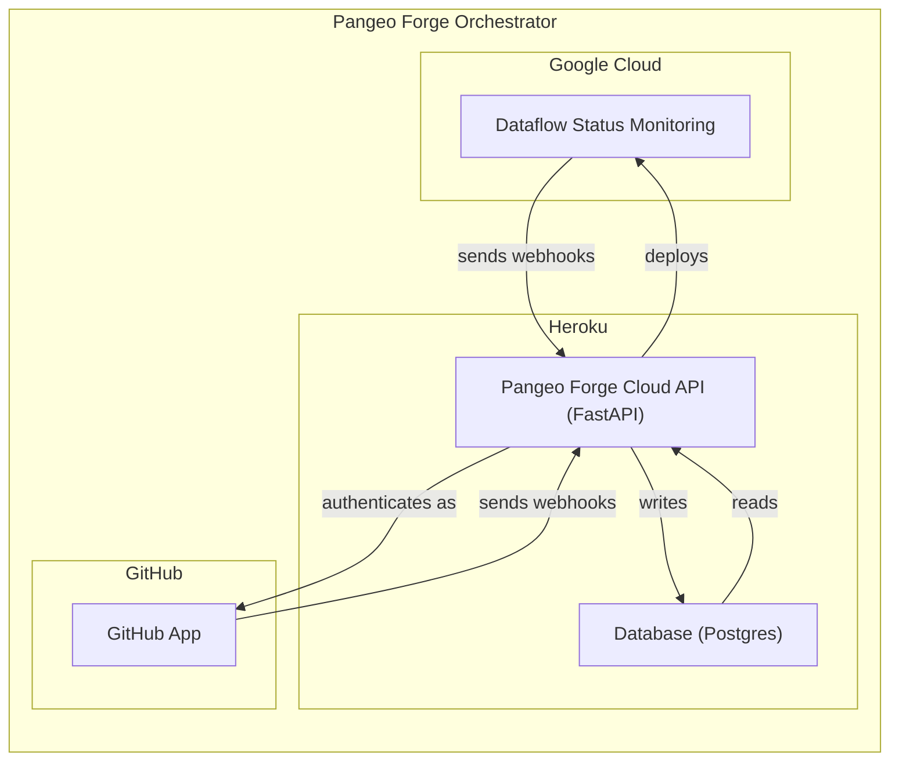
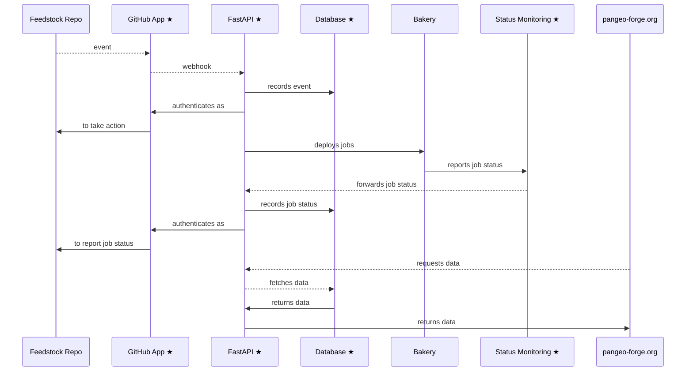
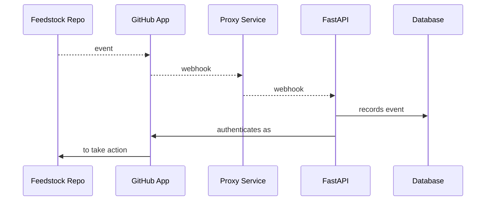
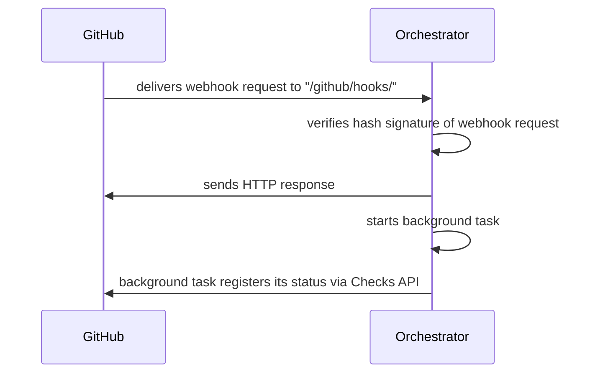
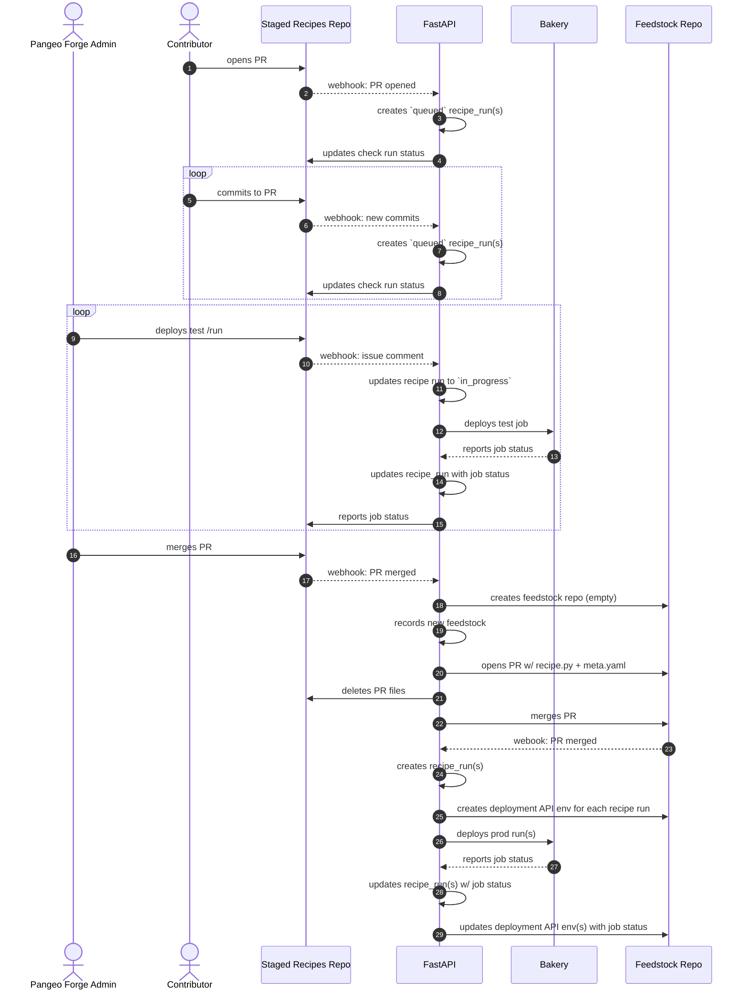
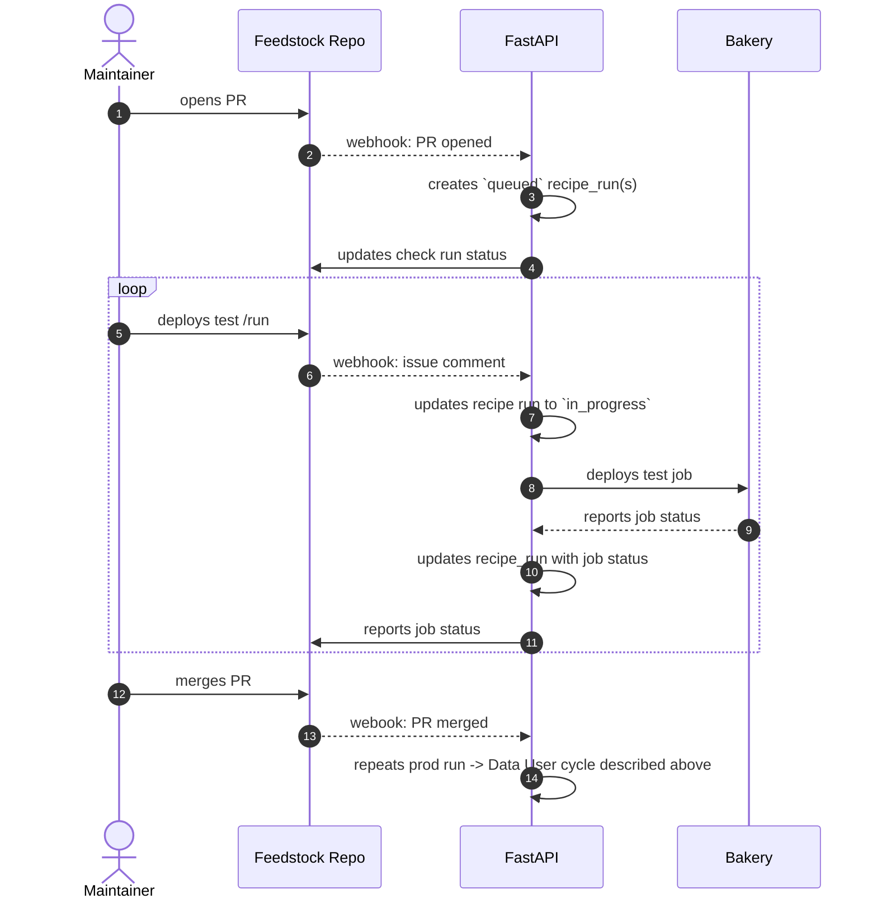

Welcome to the `pangeo-forge-orchestrator` developer docs.

We welcome anyone to contribute by opening issues on this repo. To contribute
code to this repo, you will need membership in:

- AWS `pangeo-forge` team (with KMS permissions)
- Heroku `pangeo-forge` team
- GitHub `pangeo-forge` org
- GitHub `pforgetest` org (with owner role. Otherwise, you can't manage GitHub App within the org)
- GCP `pangeo-forge-4967` project

Over time, we aim to establish a pathway for contributors
external to the above-listed teams to contribute code to this repository.

# Table of Contents

- [What is Pangeo Forge Orchestrator?](#what-is-pangeo-forge-orchestrator) - Introduces the four
  components deployed and/or configured by this repo, and their relationship to other components of
  Pangeo Forge Cloud.
- [Deployments: overview](#deployments-overview) - General presentation of the four deployment types,
  including naming format, resource locations for each deployment stage, and common requirements.
- [How to use SOPS](#how-to-use-sops) - Using SOPS to encrypt/decrypt repo secrets.
- [The local deployment](#the-local-deployment) - Setup a local deployment, with optional
  proxy server.
- [Heroku deployments](#heroku-deployments) - Overview of Heroku configuration and details
  on how to deploy each of the three Heroku deployments (review, staging, and prod).
- [Debugging Docker issues](#debugging-docker-issues) - Use docker-compose to debug Docker builds.
- [Database: migrations with Alembic](#database-migrations-with-alembic) - Generating new database
  versions automatically.
- [Database: manual edits](#database-manual-edits) - Manually edit the database for any deployment.
- [Bakeries: `pangeo-forge-runner` config](#bakeries-pangeo-forge-runner-config) - Configure named
  compute & storage backends.
- [Bakeries: job status monitoring](#bakeries-job-status-monitoring) - This is how the FastAPI app
  knows when compute jobs have concluded. Terraform for this infra is run on each Heroku deploy.
- [Bakeries: querying job logs](#bakeries-querying-job-logs) - Query bakery job logs for recipe runs.
  Especially useful for diagnosing failed jobs.
- [Security](#security) - Some notes on security.
- [Testing](#testing) - Automated testing in both local envs and containerized contexts.
- [GitHub App: manual API calls](#github-app-manual-api-calls) - How to manually call the GitHub API _as a GitHub App_.
- [Roadmap](#roadmap) - Next steps.
- [Detailed sequence diagrams](#detailed-sequence-diagrams) - Fine-grained look at call stacks.

# What is Pangeo Forge Orchestrator?

This repo deploys and/or configures four difference components. These components, along with their deployment
locations, are represented in the following diagram:



The next diagram demonstrates, in a general sense, how these four components interact with other components of
Pangeo Forge Cloud. Here, the four participants denoted with stars are those deployed/configured by `pangeo-forge-orchestrator`:



# Deployments: overview

Every PR to `pangeo-forge-orchestrator` travels though a series of (up to) four deployment types:


Arbitrary numbers of `local` and `review` apps may exist simultaneously.
There is only ever one `staging` and one `prod` deployment.

## Naming

Deployment names are formatted as follows:

| type      | naming format                                      | example                    |
| --------- | -------------------------------------------------- | -------------------------- |
| `local`   | `pforge-local-${Developer's GitHub Username}`      | `pforge-local-cisaacstern` |
| `review`  | `pforge-pr-${pangeo-forge-orchestrator PR Number}` | `pforge-pr-136`            |
| `staging` | always named `pangeo-forge-staging`                | n/a                        |
| `prod`    | always named `pangeo-forge`                        | n/a                        |

## Resource locations

| type      | FastAPI | Database | GitHub App (Organizaton) | Status Monitoring (Terraform Env) |
| --------- | ------- | -------- | ------------------------ | --------------------------------- |
| `local`   | local   | local    | `pforgetest`             | `dev`                             |
| `review`  | Heroku  | Heroku   | `pforgetest`             | `dev`                             |
| `staging` | Heroku  | Heroku   | `pforgetest`             | `pangeo-forge-staging`            |
| `prod`    | Heroku  | Heroku   | `pangeo-forge`           | `pangeo-forge`                    |

## Common requirements

All deployments require:

1. A secrets config file named `secrets/config.${deployment-name}.yaml`:

   ```yaml
   # secrets/config.${deployment-name}.yaml

   fastapi:
     # this key is generated by `scripts.develop/generate_api_key.py`
     PANGEO_FORGE_API_KEY: ${api key for protected fastapi routes}
   github_app:
     # following fields are auto-generated by github on app creation
     # new apps are created with `scripts.develop/new_github_app.py`
     app_name: ${the deployment name}
     id: ${github app id}
     private_key: ${github app rsa private key}
     webhook_secret: ${github app hmac webhook secret}
   ```

2. `PANGEO_FORGE_DEPLOYMENT` env var. The deployment name, e.g. `pforge-pr-136`, or `pangeo-forge-staging`.
3. AWS CLI authentication. The AWS account must have read access to the `pangeo-forge` AWS project KMS.
4. `DATABASE_URL` env var. A valid SQLAlchemy URI pointing to a SQLite (for local deployments) or
   Postgres (for all other deployments) database.

# How to use SOPS

Credentials for each deployment are commited to the `pangeo-forge-orchestrator` repo as encrypted YAML.
Committing encrypted secrets directly to this repo allows for transparent and version-controlled
management of credentials. [SOPS](https://github.com/mozilla/sops) is used to encrypt and decrypt these
files. The [pre-commit-hook-ensure-sops](https://github.com/yuvipanda/pre-commit-hook-ensure-sops) and `gitleaks` hooks
installed in this repo's `.pre-commit-config.yaml` ensure that we don't accidentally commit unencrypted
secrets. For this reason, please always make sure that
[**pre-commit is installed**](https://pre-commit.com/#quick-start) in your local development environment.

The `sops.yaml` config in this repo instructs SOPS to use a particular pair of AWS KMS keys for
encryption and decryption of secrets. Members of the `pangeo-forge` AWS project with access to KMS
can use these keys for encrypt/decrypt operations.

## Setup

1. Make sure you are signed into the AWS CLI with `aws configure`.
2. Install SOPS. On MacOS, the easiest way is probably `brew install sops`.

## Encrypt

```console
$ sops -e -i secrets/${filename}
```

## Decrypt

```console
$ sops -d -i secrets/${filename}
```

# The `local` deployment

## Secrets config

### FastAPI

To generate FastAPI credentials for the `local` deployment, from the repo root, run:

```console
$ python3 scripts.develop/generate_api_key.py ${Your GitHub Username} local
```

Now, `secrets/config.pforge-local-${Your GitHub Username}.yaml` should contain an api key.

### GitHub App

> **Note**: If you do not plan to work on the `/github` routes, you can skip this.

Add GitHub App creds to your secret config with:

```console
$ GITHUB_PAT=${Your GitHub PAT} python3 scripts.develop/new_github_app.py ${Your GitHub Username} local
```

Your `GITHUB_PAT` should have repo scope, and you will also need to be a member of the
`pforgetest` GitHub organization. The script will start a local webserver and prompt you to
navigate to a particular URL to complete an in-browser OAuth flow. Follow the in-browser prompts.

## Database

The easiest way to set the `DATABASE_URL` env var is by using a sqlite database, as follows:

```console
$ export DATABASE_URL=sqlite:///`pwd`/database.sqlite
```

The file `database.sqlite` does not need to exist before you start the application; the application will
create it for you on start-up. Note that of the four deployment types , the `local` deployment is the only once which can use sqlite. All of the others use postgres:

|          | local | review | staging | prod |
| -------- | ----- | ------ | ------- | ---- |
| sqlite   | ✅    | ✖️     | ✖️      | ✖️   |
| postgres | ✅    | ✅     | ✅      | ✅   |

As noted by this table, the `local` deployment _can_ also run with postgres. This may be useful for
debugging issues related to postgres specifically. (The sqlite and postgres idioms, while similar, are
different enough that code developed _only_ against sqlite can sometimes fail against postgres.) To use a local Postgres server:

1. Install https://postgresapp.com
2. Start the database using the app
3. Run `echo "CREATE DATABASE ${Your Database Name};" | psql` to create a database
4. Set `export DATABASE_URL=postgresql://localhost/${Your Database Name}`
5. If your working branch changes the SQLModel models, generate a new database version
   according to [Database: Migrations with Alembic](#database-migrations-with-alembic)
6. Run `python -m alembic upgrade head` to run migrations against the Postgres `DATABASE_URL`

## Proxy

> **Note**: If you do not plan to work on the `/github` routes, you can skip this.

To receive GitHub webhooks on your local deployment, you will need a proxy service to forward
them to you from GitHub, like this:



Navigate to https://smee.io/ and click **Start a new channel**. Smee will generate a your proxy url for
you, which will look something like this: https://smee.io/pGKLaDu6CJwiBjJU. Assign this url to an env var, e.g.:

```console
$ export PROXY_URL=https://smee.io/pGKLaDu6CJwiBjJU
```

Navigating to the smee proxy url in a browser will provide you instructions for installing the smee
command line utility. Install it, then start the smee client with:

```console
$ smee -u $PROXY_URL -p 8000 --path /github/hooks/
```

where `-p` is the localhost port you plan to serve FastAPI on, and `--path` is the FastAPI route
to which GitHub App webhooks are posted. Finally, update your GitHub App's webhook url so that it
will send webhooks to the proxy:

```console
$ python3 scripts.develop/update_hook_url.py secrets/pforge-local-${Your GitHub Username} $PROXY_URL

200 {"content_type":"json","secret":"********","url":"https://smee.io/pGKLaDu6CJwiBjJU","insecure_ssl":"0"}
```

The `"url"` field in the response should refect the `PROXY_URL` you passed to the script. Your
GitHub App will now send webhooks to the specified proxy url. You can change your proxy url at any
time by re-running this last script with a different argument.

## Bakeries config

The last step before starting the app server is to setup bakeries config for your local app instance. You can create a configuration file with the bakery information by copying the `bakeries/pangeo-ldeo-nsf-earthcube.pforge-local-cisasacstern.yaml` file to `bakeries/pangeo-ldeo-nsf-earthcube.local-${Your GitHub Username}.yaml`:

```console
$ cp bakeries/pangeo-ldeo-nsf-earthcube.pforge-local-cisasacstern.yaml bakeries/pangeo-ldeo-nsf-earthcube.local-${Your GitHub Username}.yaml
```

Finally, decrypt the secret args for this bakery:

```console
$ sops -d -i secrets/bakery-args.pangeo-ldeo-nsf-earthcube.yaml
```

> **Note from @cisaacstern**: This entire bakeries config setup (which I wrote) is _far to convoluted_. These
> instructions are designed to get your local app running under the current paradigm. This should be revisited and
> simplified considerably. For further discussion on this, see https://github.com/pangeo-forge/pangeo-forge-orchestrator/pull/129.

## Start the server

If you have not already, in a clean Python 3.9 env, from the repo root run:

```console
$ pip install -e '.[dev]'
```

to install the app dependencies. The from the repo root, run:

```console
$ uvicorn pangeo_forge_orchestrator.api:app --reload --reload-dir=`pwd`/pangeo_forge_orchestrator
```

to start the dev server with hot reloads.

## Install your GitHub App in `pforgetest`

> **Note**: If you do not plan to work on the `/github` routes, you can skip this.

Finally, navigate to https://github.com/organizations/pforgetest/settings/apps. Find your newly created app
on the list of GitHub Apps. Click on it, and then install it in all repositories in `pforgetest`.

If other apps are installed on `pforgetest` (e.g. `pangeo-forge-staging`, some review apps), you
may want to suspend those installations (if other developers are not currently using them).
Otherwise, you will see multiple responses to each PR event. This is not necessarily problematic,
except for the fact that it may be confusing/chaotic.

TODO: In the future, we may want to filter which apps response to a particular event based on
PR labels. This would allow multiple simultaneous installations without overlapping event responses.

# Heroku deployments

The application is configured to deploy on Heroku using Heroku pipelines. Setting this up took some
trial and error, but now it works great. These documentation pages may be helpful to understanding
the Heroku configuation:

- [How Heroku Works](https://devcenter.heroku.com/articles/how-heroku-works)
- [Heroku Piplines](https://devcenter.heroku.com/articles/pipelines)
- [Heroku Review Apps](https://devcenter.heroku.com/articles/github-integration-review-apps)
- [Heroku Postgres](https://devcenter.heroku.com/articles/heroku-postgresql)

Pipeline main link: [pangeo-forge-api-flow](https://dashboard.heroku.com/pipelines/17cc0239-494f-4a68-aa75-3da7c466709c) (membership in Heroku `pangeo-forge` group required for access)

## Relevant files

- `Dockerfile` - The FastAPI worker image.
- `requirements.txt` - Dependencies to be pip-installed in FastAPI image to build the app's environment. Versions are pinned for stability. We will need to manually update these on a regular schedule.
- `heroku.yml` - Configures Heroku container stack.
  - More details here: https://devcenter.heroku.com/articles/build-docker-images-heroku-yml.
- `app.json` - More configuration, including `PANGEO_FORGE_DEPLOYMENT` env var for review apps.
- `scripts.deploy/release.sh` - The release script used for all Heroku deployments. This script:
  1.  Runs database migrations with alembic
  2.  Runs terraform (in the deployment specific terraform env) to ensure that status monitoring
      infra exists on dataflow for the current release. See
      [Bakeries: Job status monitoring](#bakeries-job-status-monitoring) for more on this.

> **Note**: Heroku's container stack is not supported on Heroku CI. Therefore we use
> `docker-compose.yml` for [Testing](#testing) this stack on GitHub Actions.

## DNS

DNS is managed at https://dns.he.net/ under Ryan's account.
It was configured following the [Heroku custom domains docs](https://devcenter.heroku.com/articles/custom-domains).
The two relevant records are:

| name                         | type  | TTL  | data                                                    |
| ---------------------------- | ----- | ---- | ------------------------------------------------------- |
| api-staging.pangeo-forge.org | CNAME | 1800 | ancient-woodland-ma1jj1m5y8687aopzbpq523p.herokudns.com |
| api.pangeo-forge.org         | CNAME | 1800 | powerful-harbor-5b6ajvki0ysxoh3gk56ksmi0.herokudns.com  |

Both staging and prod are set up with [automatic certificate management](https://devcenter.heroku.com/articles/automated-certificate-management).

## `review`

For each PR to `pangeo-forge-recipes`, Heroku creates a Review App which will hang around for two days.
This is a live version of the app running against an ephemeral database. It can be used for manual
checks or further integration testing.

> We use Heroku's Review Apps
> [injected-environment-variables](https://devcenter.heroku.com/articles/github-integration-review-apps#injected-environment-variables)
> feature to dynamically set the `PANGEO_FORGE_DEPLOYMENT` env var for review apps to the value of the injected env var `HEROKU_APP_NAME`, which follows the pattern `pforge-pr-${PR number}`. Take a look at both `heroku.yml` and `scripts.deploy/release.sh` to see where this happens.

> We also use Heroku's Review Apps
> [postdeploy script](https://devcenter.heroku.com/articles/github-integration-review-apps#the-postdeploy-script)
> feature to automatically seed each review app database with the
> https://github.com/pforgetest/test-staged-recipes feedstock.
> To see where this happens (and/or seed additional test data), see `postdeploy/seed_review_app_data.py`.

To ensure a successful build of a Review App for your PR:

1. Generate a `secrets/pforge-pr-${PR number}.yaml` secrets config for your review app, by:
   1. Running:
      ```console
      $ python3 scripts.develop/generate_api_key.py pforge-pr-${PR number}
      ```
   2. Then running:
      ```console
      $ GITHUB_PAT=${Your GitHub PAT} python3 scripts.develop/new_github_app.py ${GitHub Username} review ${PR number}
      ```
      and following the link to complete the in-browser OAuth flow.
2. Encrypting the secrets config with:
   ```console
   $ sops -e -i secrets/pforge-pr-${PR number}.yaml
   ```
3. Rename the review app bakery config as follows (where `SOME_OTHER_NUMBER` is a prior review app's PR number):
   ```console
   $ mv bakeries/pangeo-ldeo-nsf-earthcube.pforge-pr-SOME_OTHER_NUMBER.yaml bakeries/pangeo-ldeo-nsf-earthcube.pforge-pr-${PR number}.yaml
   ```
4. Push these changes (the secrets and bakeries config for your review app) to your PR
5. From https://github.com/organizations/pforgetest/settings/apps, manually install the
   `pforge-pr-${PR number}` app on all repos in the `pforgetest` org. (Optionally, suspend
   all other installations from `pforgetest`, so that multiple apps are not active at one time.)
6. Update the Review App's webhook url (decrypting your review app creds first):
   ```console
   $ sops -d -i secrets/pforge-pr-${PR number}.yaml
   $ python3 scripts/update_hook_url.py review http://pforge-pr-${PR number}.herokuapp.com
   ```

> **Tip**: The first review app build often fails, perhaps because the PR was opened before all
> of the above steps were complete. If the build fails, navigate to
> [the Heroku Pipeline dashboard](https://dashboard.heroku.com/pipelines/17cc0239-494f-4a68-aa75-3da7c466709c)
> and manually delete the Review App. Then, manually click
> "create review app". Typically, this build will succeed if everything has been configured
> correctly. If it fails, there may be a deeper issue in play. _**Important**_: A failed Review
> App build _will not be fixed_ by simply re-releasing. It must be deleted and then rebuilt from
> scratch.

## `staging`

Changes merged to `main` will deploy the
[pangeo-forge-api-staging](https://dashboard.heroku.com/apps/pangeo-forge-api-staging)
app to the "staging" environment. This is currently the only deployment configured in Heroku.
It app is configured with a `heroku-postgresql:hobby-0` add-on.
([Database control panel](https://data.heroku.com/datastores/1eae941d-caa0-405b-8e41-08f8959f7db2))

The staging app secrets config are stored in `secrets/config.pangeo-forge-staging.yaml`.

To experiment with the staging app's behavior on GitHub, navigate to
https://github.com/pforgetest/settings/apps and make sure the `pangeo-forge-staging` GitHub App
installation is active on all repositories in the `pforgetest` org.

## `prod`

Changes merged to `prod` will deploy the [pangeo-forge-api-prod](https://dashboard.heroku.com/apps/pangeo-forge-api-prod) app to the "staging" environment.
This is currently the only deployment configured in Heroku.
It app is configured with a `heroku-postgresql:standard-0` add-on.
([Database control panel](https://data.heroku.com/datastores/bcd81fa2-0601-4882-b439-d5cefc63dfe3))

The staging app secrets config are stored in `secrets/config.pangeo-forge.yaml`.

The produciton app is the only GitHub App installed in the public-facing `pangeo-forge` org.

# Debugging Docker issues

To debug Docker issues, such as container build issues, you can stand up a close facsimile of the
production stack by running, from the repo root:

```console
$ AWS_ACCESS_KEY_ID=${Your AWS access key} \
AWS_SECRET_ACCESS_KEY=${Your AWS secret} \
PANGEO_FORGE_DEPLOYMENT=pforge-local-${Your GitHub username} \
docker-compose up --build
```

Here, the AWS credentials are used to authenticate with the AWS CLI at container start time, which
allows the container to decrypt your local creds on startup.

# Database: migrations with Alembic

This application is configured to use Alembic database migrations.
The configuration was pieced together from the following resources:

- Generic Alembic tutorial: https://alembic.sqlalchemy.org/en/latest/tutorial.html
- Using sqlmodel with Alembic: https://github.com/tiangolo/sqlmodel/issues/85#issuecomment-917228849

## Relevant Files

- `alembic.ini` - Alembic configuration file
- `migrations/env.py` - The migration environment; customized to work with
  sqlmodel our test / deployment environment
- `migrations/versions/*.py` - Auto-generated scripts which perform the migrations.

## `DATABASE_URL` Environment Variable

Both the migration environment and the FastAPI app itself are configured to use
the `DATABASE_URL` environment variable to determine which database to connect to.
This string must be a valid sqlalchemy database URI.

The Heroku deployment environments automatically set this environment variable
to point to the appropriate postgres database.

## Running Migrations

The command

```bash
python -m alembic upgrade head
```

will initialize the database located at `DATABASE_URL` to the latest version of
the schema. If no tables are present, it will create them. If a different version
exists, it will migrate. For more details on how this works, see the Alembic docs.

**A migration must be run before the app is started on a fresh database!**
Otherwise the tables will not exist. (The app code itself no longer creates tables.)

## Creating a new Database Version

Any time the SQLModel table models are changed in any way, a new migration
script has to be generated. _This is done automatically by Alembic!_ It's magic.
To create a new migration script, simply edit the models and then run.

```python
python -m alembic revision --autogenerate -m "Description of migration"
```

(Syntax and concepts are very similar to Git.)
This will place a new script in `migrations/versions/` which Alembic will run
when we want to migrate.
If the migration is complex or ambiguous, the migration script might have to be
tweaked manually.

# Database: manual edits

Generally, the FastAPI application should be making most/all edits to the database contents.
The most common reason for wanting to manually edit a database is for adding test data to a
development database. Another important reason would be to fix/patch data in the production
database. To do this:

1. Decrypt the creds for the deployment whose database you'd like to edit:
   ```console
   $ sops -d -i secrets/config.${deployment name}.yaml
   ```
2. Edit the `PANGEO_FORGE_DEPLOYMENT`, `app_address`, `data`, and `route` values
   in the example below, to make authenticated calls to the API

```python
import os
import json
import requests
from pangeo_forge_orchestrator.config import get_fastapi_config

os.environ["PANGEO_FORGE_DEPLOYMENT"] = "pforge-pr-136"
app_address = "https://pforge-pr-136.herokuapp.com"
headers = {
    "X-API-Key": get_fastapi_config().PANGEO_FORGE_API_KEY,
    "accept": "application/json",
    "Content-Type": "application/json",
}

data = {"spec": "pangeo-forge/staged-recipes"}
route = "feedstocks/"

response = requests.post(
    f"{app_address}/{route}",
    headers=headers,
    data=json.dumps(data),
)
response.status_code  # --> 200
response.json()  # -->  {'spec': 'pangeo-forge/staged-recipes', 'provider': 'github', 'id': 1}
```

# Bakeries: `pangeo-forge-runner` config

In a recipes PR, when a contributor specifies the name of their target bakery, e.g.:

```yaml
# meta.yaml
# ...
bakery:
  id: 'pangeo-ldeo-nsf-earthcube'
```

what does Pangeo Forge Orchestrator do with this information?

The answer lies first in the `bakeries/` directory. Here we have a set of YAML files with names
conforming to the style `{bakery-name}.{deployment-name}.yaml`, i.e.:

```
bakeries
├── pangeo-ldeo-nsf-earthcube.pangeo-forge-staging.yaml
├── pangeo-ldeo-nsf-earthcube.pangeo-forge.yaml
├── pangeo-ldeo-nsf-earthcube.pforge-local-cisaacstern.yaml
└── pangeo-ldeo-nsf-earthcube.pforge-pr-125.yaml
```

In `pangeo_forge_orchestrator/config.py`, the FastAPI application looks for all unique bakery names
in this directory _for which the `.{deployment-name}.` equals the `PANGEO_FORGE_DEPLOYMENT`_ env var.
For example, if `PANGEO_FORGE_DEPLOYMENT=pangeo-forge-staging`, then FastAPI will identify
`bakeries/pangeo-ldeo-nsf-earthcube.pangeo-forge-staging.yaml` as the config for
`pangeo-ldeo-nsf-earthcube` in the FastAPI instance.

What if a bakery requires secrets as part of its config? For each bakery identified in the `bakeries/`
directory, `pangeo_forge_orchestrator/config.py` will check for a corresponding file in the `secrets/`
directory. If a file exists with the name `secrets/bakery-args.{bakery-name}.yaml`, the values in this
file will be loaded and added to the bakery's configuration.

This combined public + secret config object will be used in subprocess calls to https://github.com/
pangeo-forge/pangeo-forge-runner.

> **Note**: Currently the config passes from YAML on disk, to a Pydantic model in-memory, and then
> is eventually dumped to a temporary JSON file on disk for each `pangeo-forge-runner` call. This is
> unnecessarily convoluted. Some notes on how it could be improved are available in
> https://github.com/pangeo-forge/pangeo-forge-orchestrator/pull/129.

# Bakeries: job status monitoring

An important function of Pangeo Forge Orchestrator is to deploy the status monitoring infrastructure
which watches for job status completion on each bakery. While it might initially seem like this
should be the bakery's responsiblity, in fact deploying this infrastructure from Pangeo Forge
Orchestrator is essential, because this ensures that _**each deployed FastAPI instance** will always
have a compatible status monitoring deployment on each bakery it is configured to interoperate with_.

## Dataflow

For Google Cloud Dataflow, status monitoring infrastructure is defined in the
`dataflow-status-monitoring` submodule of this repo.

## Flink

Status monitoring is not yet implemented for Flink.

## Terraform Environments

On each Heroku release, `scripts.deploy/release.sh` runs terraform to ensure that the status
monitoring infrastructure is up-to-date for the current release. Three distinct terraform
environments are defined in the `terraform/` directory in this repo:

```
terraform
├── dev
│   └── main.tf
├── pangeo-forge
│   └── main.tf
└── pangeo-forge-staging
    └── main.tf
```

Using separate terraform envs for dev (inclusive of `local` and `review` deployments), `staging`, and
`prod` ensures that releases of Review Apps, e.g., will not accidentally teardown or break prod's
status monitoring infra.

This project layout is based directly on https://blog.gruntwork.io/how-to-manage-terraform-state-28f5697e68fa.

See also [Resource locations](#resource-locations) for a table referencing these terraform envs.

# Bakeries: querying job logs

To query logs for recipe runs, see the API docs at the `/docs#/logs` route of the deployment
(https://api.pangeo-forge.org/docs#/logs for the production deployment).
These routes are protected, due to the risk of leaking secrets in the logs. The
`PANGEO_FORGE_API_KEY` is available to admins via in the deployments secrets config:

```console
$ sops -d -i secrets/config.${PANGEO_FORGE_DEPLOYMENT}.yaml
# cat secrets/config.${PANGEO_FORGE_DEPLOYMENT}.yaml
```

# Security

## Database API

Clients authenticate by providing their API key in the `X-API-Key` HTTP header.
The configuration is based loosely on https://github.com/mrtolkien/fastapi_simple_security.
Keys can be updated by decrypting credentials and re-running `scripts.develop/generate_api_key.py`.

There are currently two levels of authorization in the app

- _Unauthenticated Access_ - only GET operations
- _Authenticated Access_ - Anyone with a valid api key can POST, UPDATE, DELETE.

Moving forward, we will likely need to make this more fine-grained.
In particular, we may wish to associate API keys with bakeries and / or users,
and restrict permissions based on these properties.

TODO:

- Implement key expiry policies
- Link keys to specific users and / or bakeries i.e. service accounts. (If/wheb need arises.)

## GitHub App

Every webhook received from GitHub comes with a hash signature which certifies that it was actually sent
by GitHub (and not a hostile actor impersonating GitHub). The first thing that the `/github/hooks/` route
handler does after receiving a webhook is to verify this hash signature. Webhooks with a missing or
incorrect hash signature are rejected, and an error code is returned to the sender.



For more on hash signature verification, see:

> https://docs.github.com/en/github-ae@latest/rest/guides/best-practices-for-integrators#secure-payloads-delivered-from-github

## Secrets

As noted in [How to use SOPS](#how-to-use-sops), SOPS is used to encrypt repo secrets.
The pre-commit hooks `pre-commit-ensure-sops` and `gitleaks` are used to minimize the chance that
unencrypted secrets are ever commited to the repo.

# Testing

## Local invocation

In a local Python 3.9 environment, tests can be run by first installing the dev dependencies:

```console
$ pip install -e '.[dev]'
```

and then calling

```console
pytest tests -v
```

## Docker invocation

Tests can also be called inside the built container. Please refer to the steps defined in
`.github/workflows/test-docker.yaml` for how to do this.

## Mocks

Note that for testing the GitHub App integration, mocking is used to stand in for both the GitHub API
and for subprocess calls to `pangeo-forge-runner`. This allows us to run the tests repeatably and
efficiently, but comes at the cost of maintenance of the mocks. We should always be keeping an eye out
for problem areas in our relationship to these two third party services (one web API, one package), and
making sure that our mocks realistically capture those areas of friction. In time, we may want to
consider adding an alternate pathway to test against the live GitHub API and/or make real calls to
`pangeo-forge-runner`. This comes with its own challenges, of course, including fixturization & managing
rate limits, in the case of the GitHub API.

# GitHub App: manual API calls

Situations may arise in which you want to call the GitHup API directly, authenticated as a
GitHub App. An example would be: you've been working on a feature which creates a check run, and then
you want to manually edit that check run. (Perhaps it's been left in an "in-progress" state.) Users
(even the owners of an app instance) can't patch check runs created by the app, so you'll need to
call the GitHub API _as the app_.

We can use the convenience functions of `pangeo_forge_orchestrator`
to help us in retreiving the necessary credentials.

## Get a JWT

```python
from pangeo_forge_orchestrator.routers.github_app import get_jwt
get_jwt()  # --> returns a JWT for your dev app
```

## Get an installation access token

```python
import aiohttp
from gidgethub.aiohttp import GitHubAPI
from pangeo_forge_orchestrator.routers.github_app import get_access_token

async with aiohttp.ClientSession() as session:
     gh = GitHubAPI(session, "your-github-username")
     token = await get_access_token(gh)
     print(token)  # --> prints an installation access token for your dev app
```

## Call the API

```python
import aiohttp
from gidgethub.aiohttp import GitHubAPI

async with aiohttp.ClientSession() as session:
    gh = GitHubAPI(session, "your-github-username")
    # certain routes require token authentication
    gh.post(
        "github/api/route/",
        # using `token` retrieved above
        oauth_token=token,
    )
    # ... and others use jwt authentication...
    gh.post(
        "github/api/some/other/route/",
        # using `jwt` created above
        jwt=jwt,
    )
```

# Roadmap

The most important strategic issue to note about the forthcoming plans for this project is:

1. `pangeo-forge-runner` executes arbitrary Python (i.e. recipes)
2. In addition to containing untrusted code, these recipes may require arbitrary environments.
3. We therefore want to isolate these calls in a sibling container.
4. To do so, we will need to be able to run a Docker daemon to build and manage these sibling
   containers, and `exec` things in them.
5. To get a Docker daemon, we will need to move off of Heroku (probably to GCP).
6. Once we are able to run a Docker daemon, we can replace `subprocess` calls to
   `pangeo-forge-runner` with `docker-py` calls.

Of course there are many other issues and features which we'll want to address, but this
one has the most far-reaching effect on the structure of the project, so highlighting it here.

# Detailed sequence diagrams

## From `staged-recipes` PR to first production run



## Updating the feedstock repository


