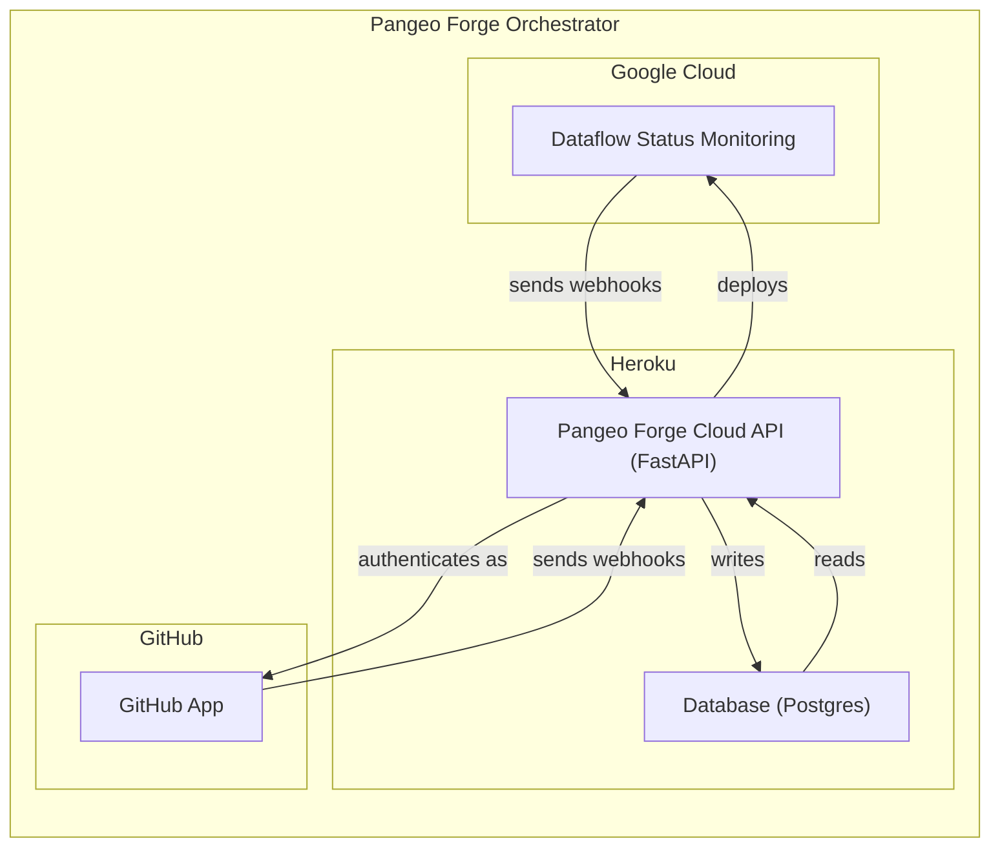
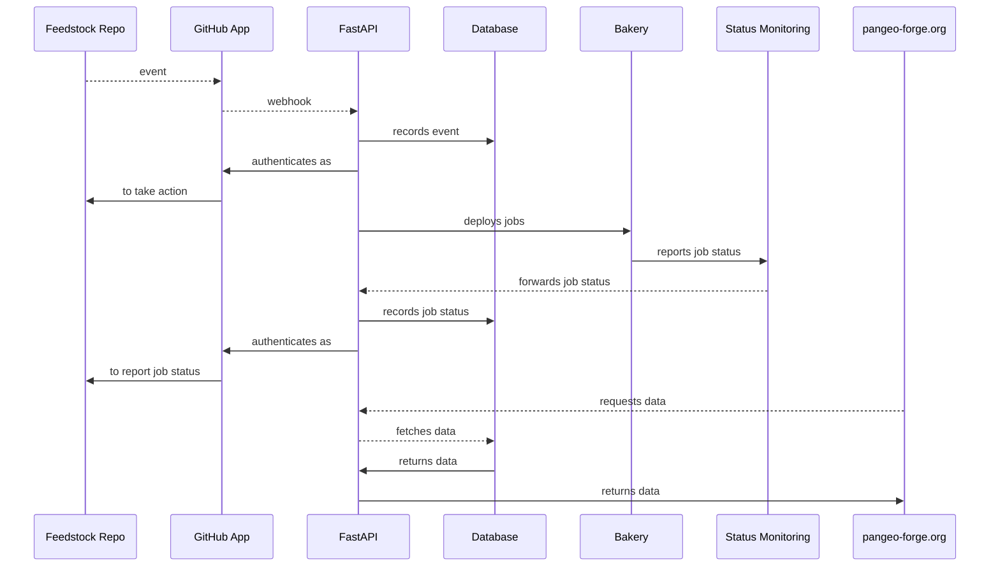

Welcome to the `pangeo-forge-orchestrator` developer docs.

For simplicity, these docs are a collection of `.md` files. The easiest way to navigate them is using the Table of Contents below.

# Table of Contents

- [What is Pangeo Forge Orchestrator?](#1-what-is-pangeo-forge-orchestrator)

# 1 What is Pangeo Forge Orchestrator?

# -------------

## Overview

- [architecture](architecture.md) - Illustrates the high-level components of Pangeo Forge Cloud.
- [sequence-diagrams](sequence-diagrams.md) - Explains the journey of a recipe, beginning with a `staged-recipes` PR, through creation of a feedstock repo, and deployment of production runs.
- [repo-structure](repo-structure.md) - At-a-glance reference for the role of most significant files and directories in this repo.
- [roadmap](roadmap.md) - A look at what's to come.
- [security](security.md) - How secrets are handled here.

## Application

The FastAPI app deployed from this repo serves two primary functions: to interface with a postgres database, and to interface with GitHub. For details of each of these roles, see:

- [database-api](database-api.md) - Details on database configuration and interface.
- [github-app](github-app.md) - Details on the GitHub App integration.

## Deployment

Every PR to `pangeo-forge-orchestrator` travels though a series of (up to) four deployments:

> **Note**: Depending on the level of complexity of the PR, the `local` and/or `review` deployments may be omitted.

Instructions

- [deploy-local](deploy-local.md) -
- [deploy-heroku](deploy-heroku.md) -

Each

- [dataflow-status-monitoring](dataflow-status-monitoring.md)

## Testing

- [testing](testing.md)
