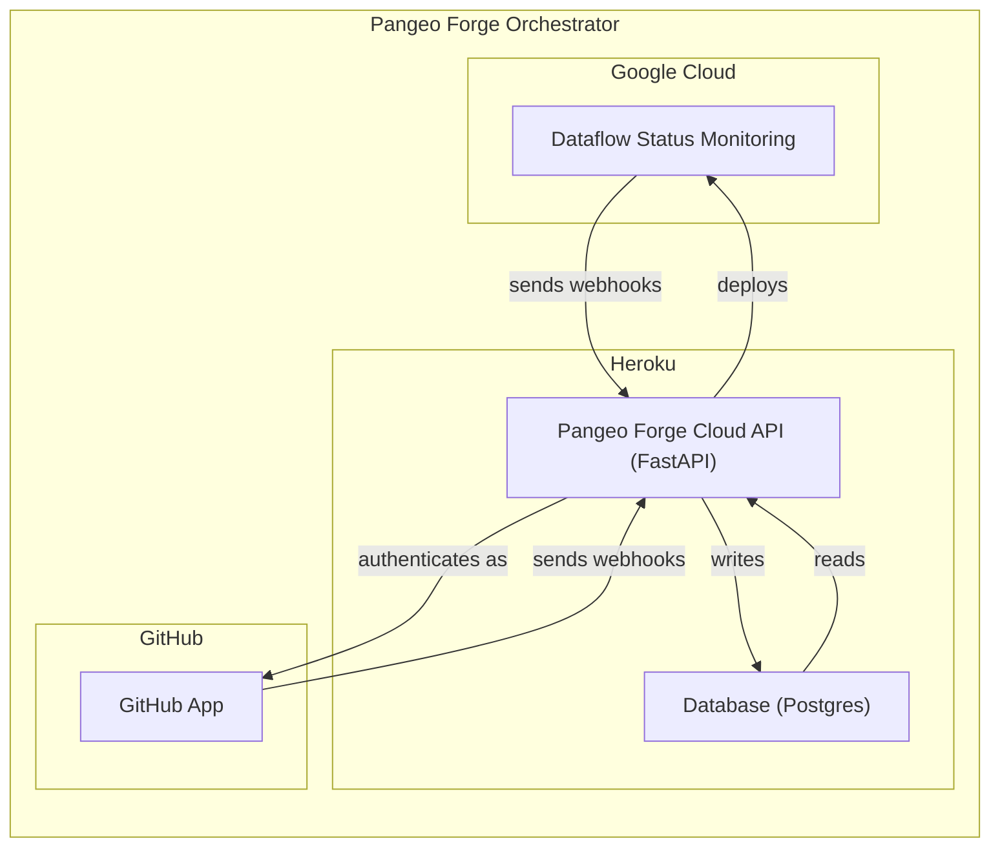
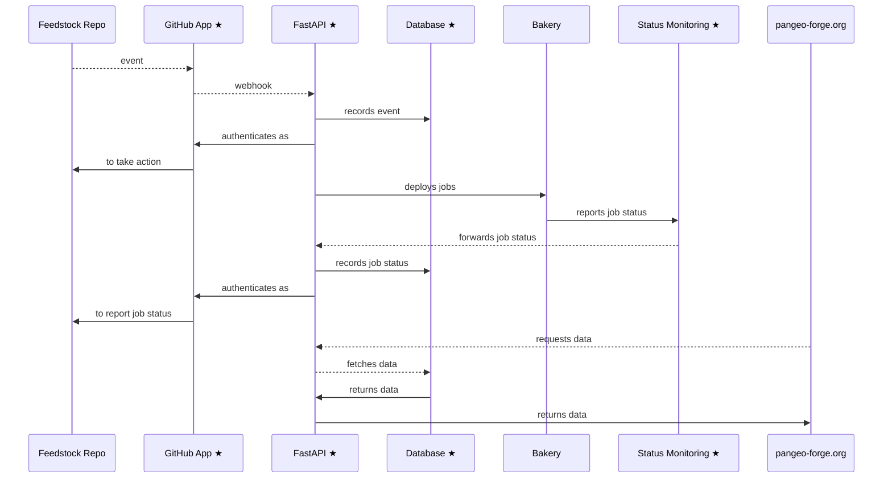
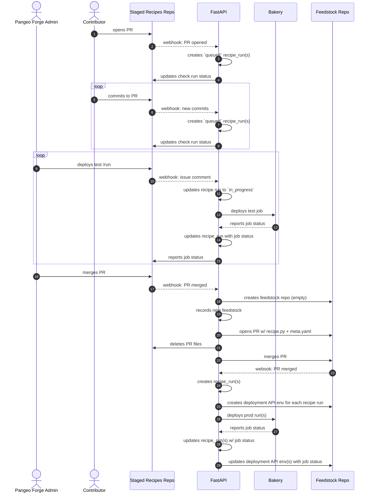
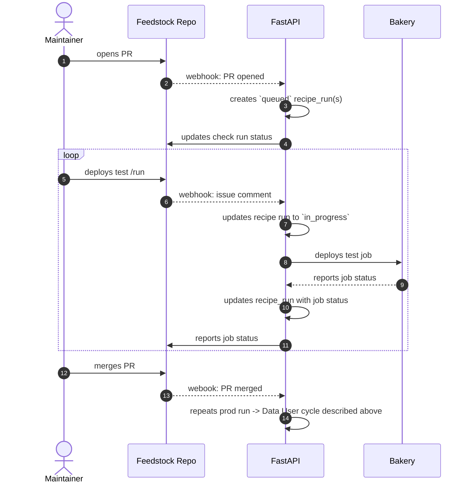

Welcome to the `pangeo-forge-orchestrator` developer docs.

For simplicity, these docs are a collection of `.md` files. The easiest way to navigate them is using the Table of Contents below.

# Table of Contents

- [What is Pangeo Forge Orchestrator?](#what-is-pangeo-forge-orchestrator)

- [Detailed sequence diagrams](#updating-the-feedstock-repository)
  - [From staged-recipes PR to first prod run](#from-staged-recipes-pr-to-first-production-run)
  - [Updating the feedstock repository](#updating-the-feedstock-repository)

# What is Pangeo Forge Orchestrator?

In the following diagram, participants denoted with stars are deployed from `pangeo-forge-orchestrator`:

# Detailed sequence diagrams

## From `staged-recipes` PR to first production run

## Updating the feedstock repository

# -------------

## Overview

- [roadmap](roadmap.md) - A look at what's to come.
- [security](security.md) - How secrets are handled here.

## Application

The FastAPI app deployed from this repo serves two primary functions: to interface with a postgres database, and to interface with GitHub. For details of each of these roles, see:

- [database-api](database-api.md) - Details on database configuration and interface.
- [github-app](github-app.md) - Details on the GitHub App integration.

## Deployment

Every PR to `pangeo-forge-orchestrator` travels though a series of (up to) four deployments:

> **Note**: Depending on the level of complexity of the PR, the `local` and/or `review` deployments may be omitted.

Instructions

- [deploy-local](deploy-local.md) -
- [deploy-heroku](deploy-heroku.md) -

Each

- [dataflow-status-monitoring](dataflow-status-monitoring.md)

## Testing

- [testing](testing.md)
