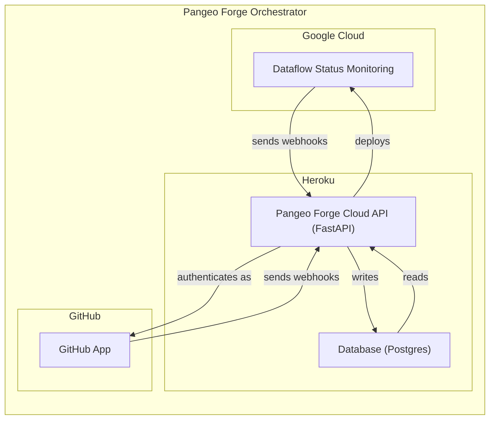
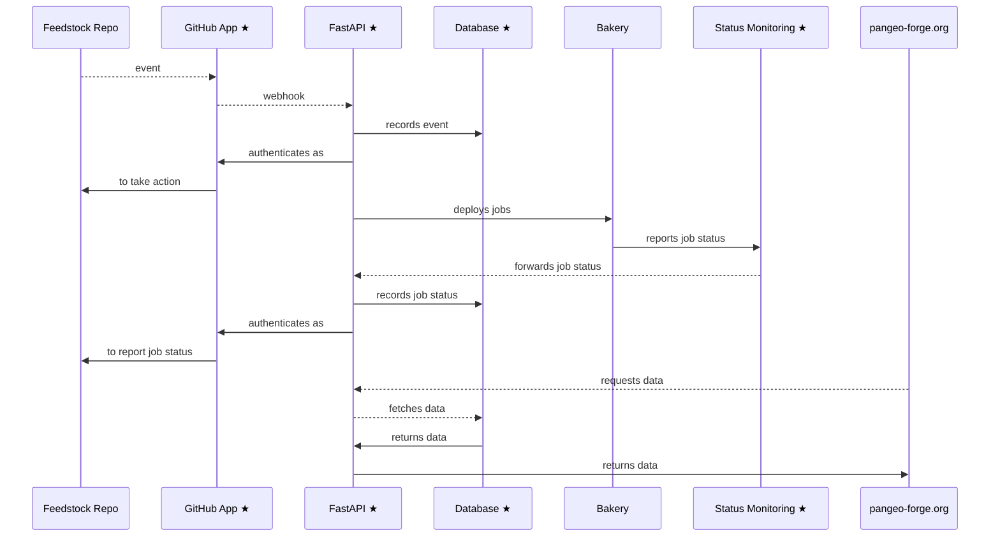
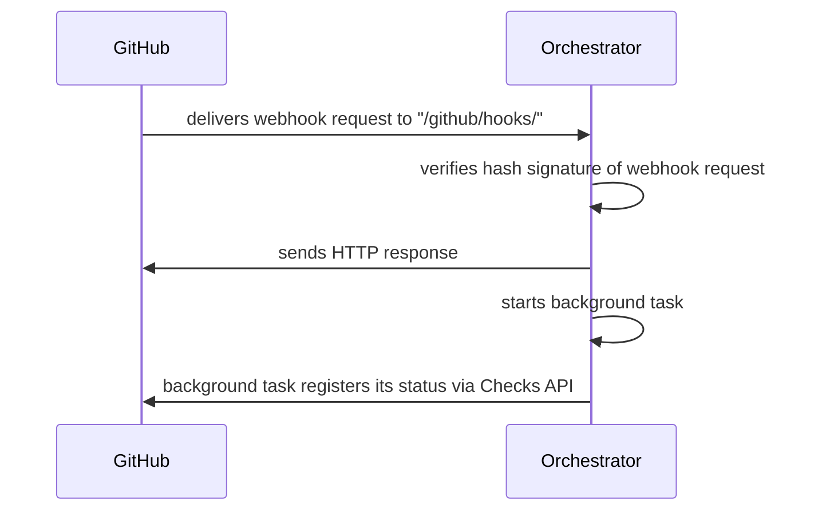
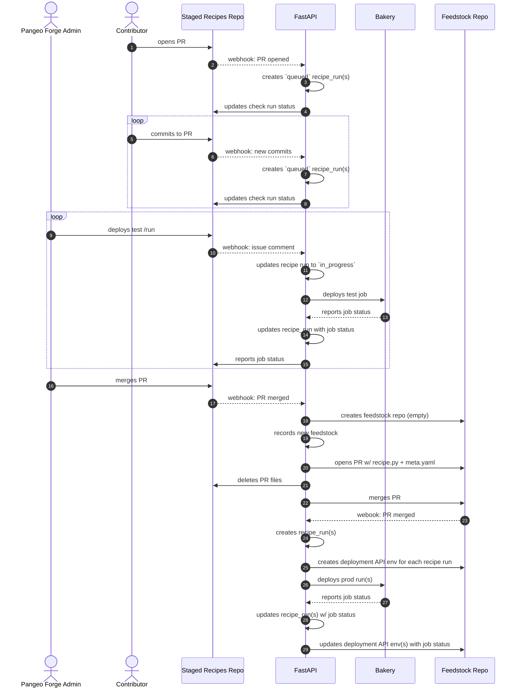
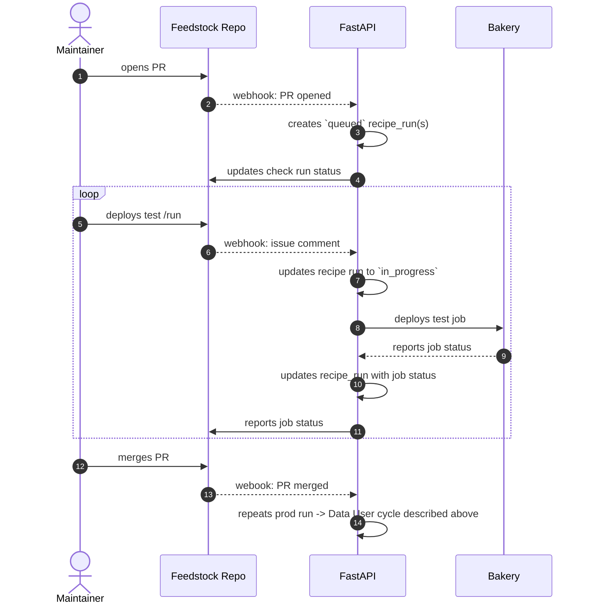

Welcome to the `pangeo-forge-orchestrator` developer docs.

**Prerequisites**: In order to work on every aspect of infrastructure deployed by this repo, you
will need to be a member of the following organizations/teams:

- GitHub `pangeo-forge` organization
- GitHub `pforgetest` organization
- Heroku `pangeo-forge` team
- AWS `pangeo-forge` team (with KMS permissions)
- GCP `pangeo-forge-4967` project (optional; there's a lot that can be accomplished
  without membership here)

Over time, we aim to lower the barrier of credentials required to contribute this repo.

# Table of Contents

- [What is Pangeo Forge Orchestrator?](#what-is-pangeo-forge-orchestrator)
- [Deployments: overview](#deployments-overview)
  - [Naming](#naming)
  - [Resource locations](#resource-locations)
  - [Requirements](#requirements)
- [The local deployment](#the-local-deployment)
- [Heroku deployments](#heroku-deployments)
  - [review](#review)
  - [staging](#staging)
  - [prod](#prod)
- [Database migrations]()
- [Detailed sequence diagrams](#updating-the-feedstock-repository)
  - [From staged-recipes PR to first prod run](#from-staged-recipes-pr-to-first-production-run)
  - [Updating the feedstock repository](#updating-the-feedstock-repository)

# What is Pangeo Forge Orchestrator?



In the following diagram, participants denoted with stars are deployed from `pangeo-forge-orchestrator`:



# Deployments: overview

Every PR to `pangeo-forge-orchestrator` travels though a series of (up to) four deployment types:


## Naming

The specific names for these deployments follow the following formats:

| type      | naming format                               | example                    |
| --------- | ------------------------------------------- | -------------------------- |
| `local`   | `pforge-local-${Developer GitHub Username}` | `pforge-local-cisaacstern` |
| `review`  | `pforge-pr-${Orchestrator PR Number}`       | `pforge-pr-136`            |
| `staging` | always named `pangeo-forge-staging`         | n/a                        |
| `prod`    | always named `pangeo-forge`                 | n/a                        |

## Resource locations

As noted above

| type      | FastAPI | Database | GitHub App (Organizaton) | Status Monitoring (Terraform Env) |
| --------- | ------- | -------- | ------------------------ | --------------------------------- |
| `local`   | local   | local    | `pforgetest`             | `dev`                             |
| `review`  | Heroku  | Heroku   | `pforgetest`             | `dev`                             |
| `staging` | Heroku  | Heroku   | `pforgetest`             | `pangeo-forge-staging`            |
| `prod`    | Heroku  | Heroku   | `pangeo-forge`           | `pangeo-forge`                    |

## Requirements

All deployments require:

1. A secrets config file named `secrets/config.${deployment-name}.yaml`, containing:

   ```yaml
   # secrets/config.${deployment-name}.yaml

   fastapi:
     PANGEO_FORGE_API_KEY: ${api key for protected fastapi routes}
   github_app:
     app_name: ${the deployment name}
     # following three fields are auto-generated
     # for us by github at app creation time
     id: ${github app id}
     private_key: ${github app rsa private key}
     webhook_secret: ${github app hmac webhook secret}
   ```

2. `PANGEO_FORGE_DEPLOYMENT`
3. To be logged into the
4. `DATABASE_URL`

# The `local` deployment

## Secret config

Before starting work on your PR, you will need a local deployment of the application to work with. In
order to run this deployment, you will need to generate credentials for FastAPI.

Each deployment requires FastAPI credentials. These are the creds that are used to authorize protected
actions on such as creating, patching, and deleting entries in the database.

To generate these credentials for the `local` deployment, from the repo root, run:

```console
$ python3 scripts.develop/generate_api_key.py local
```

If you look at `secrets/config.local.yaml` now, you should see that creds have been added to it under the
`fastapi` heading.

## Database

You will not be able to start your `local` dev server without first setting the `DATABASE_URL` env
variable, which tells the application where to connect to the database.

The easiest way to do this is by using a sqlite database, as follows:

```console
$ export DATABASE_URL=sqlite:///`pwd`/database.sqlite
```

The file `database.sqlite` does not need to exist before you start the application; the application will
create it for you on start-up. Note that of the four deployments described in the
[Deployment Lifecycle](#1-deployment-lifecycle) section above, the `local` deployment is the only once which
can use sqlite. All of the others use postgres:

|          | local | review | staging | prod |
| -------- | ----- | ------ | ------- | ---- |
| sqlite   | ✅    | ✖️     | ✖️      | ✖️   |
| postgres | ✅    | ✅     | ✅      | ✅   |

As noted by this table, the `local` deployment _can_ also run with postgres. This may be useful for
debugging issues related to postgres specifically. (The sqlite and postgres idioms, while similar, are
different enough that code developed _only_ against sqlite can sometimes fail against postgres.)

All Heroku deployments run with a Postgres server. Postgres implements certain features not present in
SQLite. As such, after your local tests passes against the SQLite database, you may want to test against
a local Postgres server as a final check. To do so:

1.  Install https://postgresapp.com
2.  Start the database using the app
3.  Run `echo "CREATE DATABASE test_db;" | psql` to create a database
4.  Set `export DATABASE_URL=postgresql://localhost/test_db`

    > If you are working on a PR that includes changes to `pangeo_forge_orchestrator.models`, you may
    > need to generate a new alembic migration version before proceeding to Step 4. Refer to **Running
    > Migrations** above for details.

5.  Run `python -m alembic upgrade head` to execute alembic migration against the new Postgres `DATABASE_URL`
6.  `pytest -vx`

# Heroku deployments

The application is configured to deploy on Heroku using Heroku pipelines.
Setting this up took some trial and error, but now it works great.
You need to read these documentation pages in order to fully understand the
Heroku configuation:

- [How Heroku Works](https://devcenter.heroku.com/articles/how-heroku-works)
- [Heroku Piplines](https://devcenter.heroku.com/articles/pipelines)
- [Heroku Review Apps](https://devcenter.heroku.com/articles/github-integration-review-apps)
- [Heroku Postgres](https://devcenter.heroku.com/articles/heroku-postgresql)

Pipeline main link: [pangeo-forge-api-flow](https://dashboard.heroku.com/pipelines/17cc0239-494f-4a68-aa75-3da7c466709c) (membership in Heroku `pangeo-forge` group required for access)

### Relevant files

- `Dockerfile` -
- `requirements.txt` - used to build the app's environment. Versions are pinned for stability.
  We will need to manually update these on a regular schedule.
- `heroku.yml` -
- `app.json` - more configuration, including

### DNS

DNS is managed at https://dns.he.net/ under Ryan's account.
It was configured following the [Heroku custom domains docs](https://devcenter.heroku.com/articles/custom-domains).
The two relevant records are:

| name                         | type  | TTL  | data                                                    |
| ---------------------------- | ----- | ---- | ------------------------------------------------------- |
| api-staging.pangeo-forge.org | CNAME | 1800 | ancient-woodland-ma1jj1m5y8687aopzbpq523p.herokudns.com |
| api.pangeo-forge.org         | CNAME | 1800 | powerful-harbor-5b6ajvki0ysxoh3gk56ksmi0.herokudns.com  |

Both staging and prod are set up with [automatic certificate management](https://devcenter.heroku.com/articles/automated-certificate-management).

## `review`

After the CI passes on a PR, Heroku creates a Review App which will hang around for two days.
This is a live version of the app running against an ephemeral database.
We could use this for manual checks or further integration testing.

## `staging`

Changes merged to `main` will deploy the
[pangeo-forge-api-staging](https://dashboard.heroku.com/apps/pangeo-forge-api-staging)
app to the "staging" environment. This is currently the only deployment configured in Heroku.
It app is configured with a `heroku-postgresql:hobby-0` add-on.
([Database control panel](https://data.heroku.com/datastores/1eae941d-caa0-405b-8e41-08f8959f7db2))

## `prod`

Changes merged to `prod` will deploy the [pangeo-forge-api-prod](https://dashboard.heroku.com/apps/pangeo-forge-api-prod) app to the "staging" environment.
This is currently the only deployment configured in Heroku.
It app is configured with a `heroku-postgresql:standard-0` add-on.
([Database control panel](https://data.heroku.com/datastores/bcd81fa2-0601-4882-b439-d5cefc63dfe3))

# Database migrations with Alembic

This application is configured to use Alembic database migrations.
The configuration was pieced together from the following resources:

- Generic Alembic tutorial: https://alembic.sqlalchemy.org/en/latest/tutorial.html
- Using sqlmodel with Alembic: https://github.com/tiangolo/sqlmodel/issues/85#issuecomment-917228849

## Relevant Files

- `alembic.ini` - Alembic configuration file
- `migrations/env.py` - The migration environment; customized to work with
  sqlmodel our test / deployment environment
- `migrations/versions/*.py` - Auto-generated scripts which perform the migrations.

## `DATABASE_URL` Environment Variable

Both the migration environment and the FastAPI app itself are configured to use
the `DATABASE_URL` environment variable to determine which database to connect to.
**This environment variable must be set in order for the app to work.**
This string must be a valid sqlalchemy database URI.

The Heroku deployment environments automatically set this environment variable
to point to the appropriate postgres database.

## Running Migrations

The command

```bash
python -m alembic upgrade head
```

will initialize the database located at `DATABASE_URL` to the latest version of
the schema. If no tables are present, it will create them. If a different version
exists, it will migrate. For more details on how this works, see the Alembic docs.

**A migration must be run before the app is started on a fresh database!**
Otherwise the tables will not exist. (The app code itself no longer creates tables.)

## Creating a new Database Version

Any time the SQLModel table models are changed in any way, a new migration
script has to be generated. _This is done automatically by Alembic!_ It's magic.
To create a new migration script, simply edit the models and then run.

```python
python -m alembic revision --autogenerate -m "Description of migration"
```

(Syntax and concepts are very similar to Git.)
This will place a new script in `migrations/versions/` which Alembic will run
when we want to migrate.
If the migration is complex or ambiguous, the migration script might have to be
tweaked manually.

# Security

## Database API routes

Clients authenticate by providing their API key in the `X-API-Key` HTTP header.
The configuration is based loosely on https://github.com/mrtolkien/fastapi_simple_security.
Keys can be updated by decrypting credentials and re-running `scripts.develop/generate_api_key.py`.

There are currently two levels of authorization in the app

- _Unauthenticated Access_ - only GET operations
- _Authenticated Access_ - Anyone with a valid api key can POST, UPDATE, DELETE.

Moving forward, we will likely need to make this more fine-grained.
In particular, we may wish to associate API keys with bakeries and / or users,
and restrict permissions based on these properties. Todo:

- Implement key expiry policies
- Link keys to specific users and / or bakeries (i.e. service accounts

## GitHub App routes

Every webhook received from GitHub comes with a hash signature which certifies that it was actually sent
by GitHub (and not a hostile actor impersonating GitHub). The first thing that the `/github/hooks/` route
handler does after receiving a webhook is to verify this hash signature. Webhooks with a missing or
incorrect hash signature are rejected, and an error code is returned to the sender.



For more on hash signature verification, see:

> https://docs.github.com/en/github-ae@latest/rest/guides/best-practices-for-integrators#secure-payloads-delivered-from-github

## Secrets

Credentials for each deployment are commited to the `pangeo-forge-orchestrator` repo as encrypted YAML.
Committing encrypted secrets directly to this repo allows for transparent and version-controlled
management of credentials. [SOPS](https://github.com/mozilla/sops) is used to encrypt and decrypt these
files. The [pre-commit-hook-ensure-sops](https://github.com/yuvipanda/pre-commit-hook-ensure-sops) hook
installed in this repo's `.pre-commit-config.yaml` ensures that we don't accidentally commit unencrypted
secrets. For this reason, please always make sure that [**pre-commit is installed**](https://pre-commit.com/#quick-start) in your local development environment.

# Testing

# History & roadmap

subprocess.run vs. dockerized subprocess

# Detailed sequence diagrams

## From `staged-recipes` PR to first production run



## Updating the feedstock repository



# -------------

## Overview

- [roadmap](roadmap.md) - A look at what's to come.
- [security](security.md) - How secrets are handled here.

## Application

The FastAPI app deployed from this repo serves two primary functions: to interface with a postgres database, and to interface with GitHub. For details of each of these roles, see:

- [database-api](database-api.md) - Details on database configuration and interface.
- [github-app](github-app.md) - Details on the GitHub App integration.

Instructions

- [deploy-local](deploy-local.md) -
- [deploy-heroku](deploy-heroku.md) -

Each

- [dataflow-status-monitoring](dataflow-status-monitoring.md)

## Testing

- [testing](testing.md)
