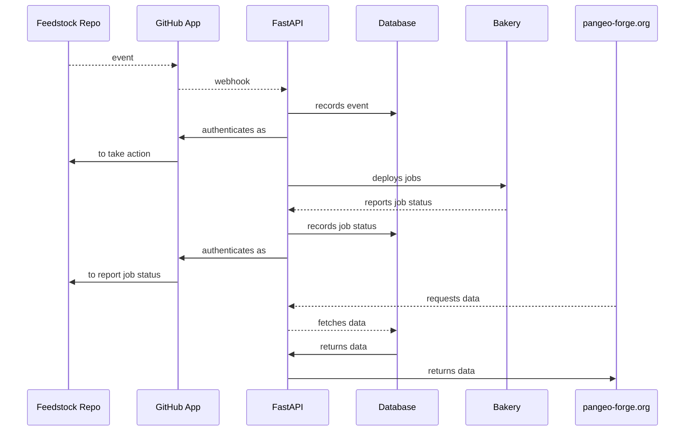

# Architecture

A high-level representation of Pangeo Forge Cloud is provided below, illustrating relationships of its main components.

**Note**: In the diagram below, the _GitHub App_, _FastAPI_, and _Database_ components are all configured and/or deployed by `pangeo-forge-orchestrator`.

