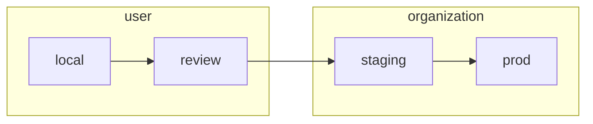

# Deployment Lifecycle

Every PR to `pangeo-forge-orchestrator` travels though a series of four deployments.


The user creates and provides `local` and `review` credentials for their PRs, whereas the organization
(i.e., `pangeo-forge`) manages credentials for the `staging` and `prod` deployments.



Each of these deployments requires a set of credentials to run. These are kept in the
`secrets` directory of this repo.

```
...
├── secrets
│   ├── config.pforge-local-cisaacstern.yaml    <- local creds for developer `cisaacstern`
│   ├── config.pforge-pr-80.yaml                <- review creds for `orchestrator` PR 80
│   ├── config.pangeo-forge-staging.yaml        <- staging creds
│   └── config.pangeo-forge.yaml                <- prod creds
...
```

Credentials for each deployment are commited to the `pangeo-forge-orchestrator` repo as encrypted YAML.
Committing encrypted secrets directly to this repo allows for transparent and version-controlled management
of credentials. [SOPS](https://github.com/mozilla/sops) is used to encrypt and decrypt these files. The
[pre-commit-hook-ensure-sops](https://github.com/yuvipanda/pre-commit-hook-ensure-sops) hook installed in
this repo's `.pre-commit-config.yaml` ensures that we don't accidentally commit unencrypted secrets. For this
reason, please always make sure that [**pre-commit is installed**](https://pre-commit.com/#quick-start)
in your local development environment.

## Heroku Deployment

The application is configured to test and deploy on Heroku using Heroku pipelines.
Setting this up took some trial and error, but now it works great.
You need to read these documentation pages in order to fully understand the
Heroku configuation:

- [How Heroku Works](https://devcenter.heroku.com/articles/how-heroku-works)
- [Heroku Piplines](https://devcenter.heroku.com/articles/pipelines)
- [Heroku CI](https://devcenter.heroku.com/articles/heroku-ci)
- [Heroku Review Apps](https://devcenter.heroku.com/articles/github-integration-review-apps)
- [Heroku Postgres](https://devcenter.heroku.com/articles/heroku-postgresql)

Pipeline main link: [pangeo-forge-api-flow](https://dashboard.heroku.com/pipelines/17cc0239-494f-4a68-aa75-3da7c466709c) (membership in Heroku `pangeo-forge` group required for access)

### Relevant files

- `runtime.txt` - tells Heroku which runtime to use to build the app.
- `requirements.txt` - used to build the app's environment. Versions are pinned for stability.
  We will need to manually update these on a regular schedule.
- `Procfile` - tells Heroku how to deploy the app.
- `app.json` - more configuration, including the test scripts run by Heroku CI

### Heroku CI

Heroku CI is like GitHub Workflows or Travis CI. It runs the test suite in the Heroku environment.
The test script is located in `app.json`. It uses an ephemeral `heroku-postgresql:in-dyno` database.
Heroku CI integrates with GitHub and registers a check-run on PRs to the GitHub repo.

### Review App

After the CI passes on a PR, Heroku creates a Review App which will hang around for two days.
This is a live version of the app running against an ephemeral database.
We could use this for manual checks or further integration testing.

### Staging Deployment

Changes merged to `main` will deploy the [pangeo-forge-api-staging](https://dashboard.heroku.com/apps/pangeo-forge-api-staging) app to the "staging" environment.
This is currently the only deployment configured in Heroku.
It app is configured with a `heroku-postgresql:hobby-0` add-on.
([Database control panel](https://data.heroku.com/datastores/1eae941d-caa0-405b-8e41-08f8959f7db2))

### Production Deployment

Changes merged to `prod` will deploy the [pangeo-forge-api-prod](https://dashboard.heroku.com/apps/pangeo-forge-api-prod) app to the "staging" environment.
This is currently the only deployment configured in Heroku.
It app is configured with a `heroku-postgresql:standard-0` add-on.
([Database control panel](https://data.heroku.com/datastores/bcd81fa2-0601-4882-b439-d5cefc63dfe3))

### DNS

DNS is managed at https://dns.he.net/ under Ryan's account.
It was configured following the [Heroku custom domains docs](https://devcenter.heroku.com/articles/custom-domains).
The two relevant records are:

| name                         | type  | TTL  | data                                                    |
| ---------------------------- | ----- | ---- | ------------------------------------------------------- |
| api-staging.pangeo-forge.org | CNAME | 1800 | ancient-woodland-ma1jj1m5y8687aopzbpq523p.herokudns.com |
| api.pangeo-forge.org         | CNAME | 1800 | powerful-harbor-5b6ajvki0ysxoh3gk56ksmi0.herokudns.com  |

Both staging and prod are set up with [automatic certificate management](https://devcenter.heroku.com/articles/automated-certificate-management).
