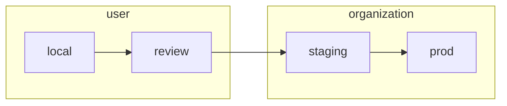

# 1 Deployment Lifecycle

Every PR to `pangeo-forge-orchestrator` travels though a series of four deployments.


The user creates and provides `local` and `review` credentials for their PRs, whereas the organization
(i.e., `pangeo-forge`) manages credentials for the `staging` and `prod` deployments.



Each of these deployments requires a set of credentials to run. These are kept in the
`secrets` directory of this repo.

```
...
├── secrets
│   ├── config.pforge-local-cisaacstern.yaml    <- local creds for developer `cisaacstern`
│   ├── config.pforge-pr-80.yaml                <- review creds for `orchestrator` PR 80
│   ├── config.pangeo-forge-staging.yaml        <- staging creds
│   └── config.pangeo-forge.yaml                <- prod creds
...
```

Credentials for each deployment are commited to the `pangeo-forge-orchestrator` repo as encrypted YAML.
Committing encrypted secrets directly to this repo allows for transparent and version-controlled management
of credentials. [SOPS](https://github.com/mozilla/sops) is used to encrypt and decrypt these files. The
[pre-commit-hook-ensure-sops](https://github.com/yuvipanda/pre-commit-hook-ensure-sops) hook installed in
this repo's `.pre-commit-config.yaml` ensures that we don't accidentally commit unencrypted secrets. For this
reason, please always make sure that [**pre-commit is installed**](https://pre-commit.com/#quick-start)
in your local development environment.
