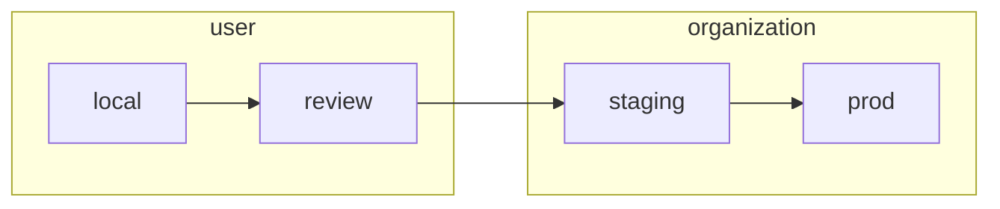

# Development Guide

This combination guide and step-by-step tutorial walks through the development process
from setup of a local dev environment, through making your first PR to `pangeo-forge-orchestrator`.

- [1 Deployment Lifecycle](#1-deployment-lifecycle)
- [2 Getting started: the local deployment](#2-getting-started-the-local-deployment)
  - [2.1 Generating credentials](#21-generating-credentials)
    - [2.1.1 GitHub App](#211-github-app)
    - [2.1.2 FastAPI](#212-fastapi)
  - [2.2 Encrypting & committing creds](#212-encrypting--committing-creds)
  - [2.3 Database](#22-database)

# 1 Deployment Lifecycle

Every PR to `pangeo-forge-orchestrator` travels though a series of four deployments.


Each of these deployments requires a set of credentials to run. These are kept in the
`secrets` directory of this repo.

```
...
├── secrets
│   ├── config.local.yaml
│   ├── config.review.yaml
│   ├── config.staging.yaml
│   └── config.prod.yaml
...
```

The user creates and provides `local` and `review` credentials for their PRs, whereas the organization
(i.e., `pangeo-forge`) manages credentials for the `staging` and `prod` deployments.



Credentials for each deployment are commited to the `pangeo-forge-orchestrator` repo as encrypted YAML.
Committing encrypted secrets directly to this repo allows for transparent and version-controlled management
of credentials. [SOPS](https://github.com/mozilla/sops) is used to encrypt and decrypt these files. The
[pre-commit-hook-ensure-sops](https://github.com/yuvipanda/pre-commit-hook-ensure-sops) hook installed in
this repo's `.pre-commit-config.yaml` ensures that we don't accidentally commit unencrypted secrets. For this
reason, please always make sure that [**pre-commit is installed**](https://pre-commit.com/#quick-start)
in your local development environment.

# 2 Getting started: the local deployment

## 2.1 Generating credentials

Before starting work on your PR, you will need a local deployment of the application to work with. In order to
run this deployment, you will need to generate credentials for a new GitHub App instance, as well as for FastAPI.

### 2.1.1 GitHub App

[GitHub Apps](https://docs.github.com/en/developers/apps/getting-started-with-apps/about-apps#about-github-apps)
are a mechanism by which third party integrations can receive webhooks and take authenticated
actions on GitHub. Users and organizations can both create GitHub Apps within their accounts. As indicated by
the diagram in [Deployment Lifecycle](#1-deployment-lifecycle), users create and manage credentials for
GitHub Apps associated with their `local` and `review` deployments.

To authorize creation of a new GitHub App, GitHub requires the user to authenticate via an in-browser oauth
flow. To initiate this process, from the root of this repo, run:

```console

```

### 2.1.2 FastAPI

### 2.2 Encrypting & committing creds

Currently, we use the
[`age` backend](https://github.com/mozilla/sops#encrypting-using-age) for SOPS.

## 2.3 Database

|          | local | review | staging | prod |
| -------- | ----- | ------ | ------- | ---- |
| sqlite   | ✅    | ✖️     | ✖️      | ✖️   |
| postgres | ✅    | ✅     | ✅      | ✅   |

## 2.4 Start the server

### 2.3.1 Proxy

#### 2.3.1.1

#### 2.3.1.2

### 2.3.2 Local server

# 3
