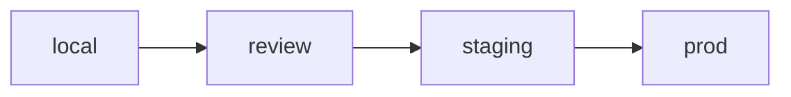
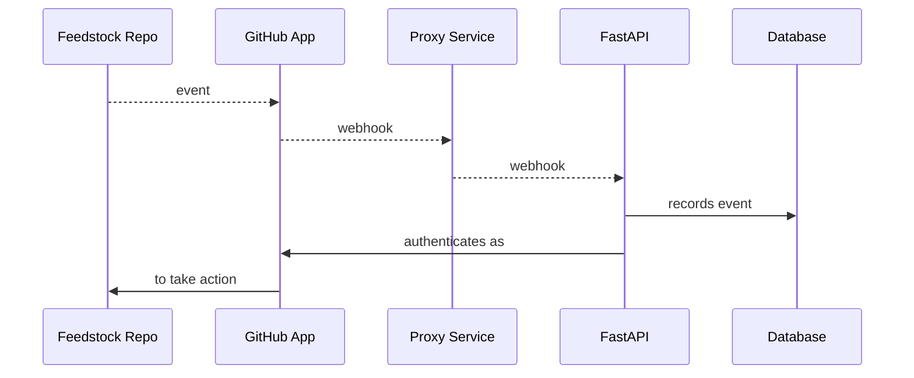
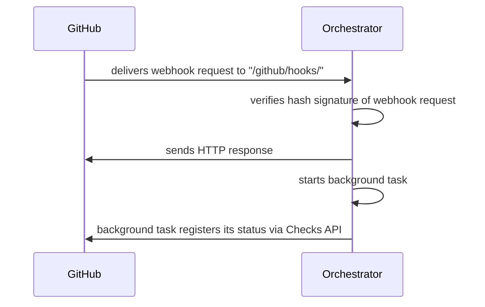

# Development Guide

This combination guide and tutorial walks through setup of a local dev environment,
through making your first PR to `pangeo-forge-orchestrator`.

**Table of Contents**

- [1 Deployment Lifecycle](#1-deployment-lifecycle)
- [2 Getting started: the `local` deployment](#2-getting-started-the-local-deployment)
  - [2.1 Generating credentials](#21-generating-credentials)
    - [2.1.1 GitHub App](#211-github-app)
    - [2.1.2 FastAPI](#212-fastapi)
  - [2.2 Encrypting & committing creds](#22-encrypting--committing-creds)
    - [2.2.1 Create an age key](#221-create-an-age-key)
    - [2.2.2 Encrypt those creds](#222-encrypt-those-creds)
  - [2.3 Database](#23-database)
  - [2.4 The proxy: selection & setup](#24-the-proxy-selection--setup)
    - [2.4.1 smee vs. ngrok](#241-smee-vs-ngrok)
    - [2.4.2 Start the proxy](#242-start-the-proxy)
      - [Option 1: with smee](#2421-option-1-with-smee)
      - [Option 2: with ngrok](#2422-option-2-with-ngrok)
    - [2.4.3 Update Github App's webhook url](#243-update-github-apps-webhook-url)
  - [2.5 Interlude: Recap](#25-interlude-recap)
  - [2.6 Start the FastAPI server](#25-start-the-fastapi-server)
- [3 Triggering webhooks](#3-triggering-webhooks)
  - [3.1 Creating a mock feedstock repo on GitHub](#31-creating-a-mock-feedstock-repo-on-github)
  - [3.2 Installing GitHub App in a mock feedstock](#32-installing-github-app-in-a-mock-feedstock)
  - [3.3 Initializing the database](#33-initializing-the-database)
  - [3.4 Triggering a webhook](#34-triggering-a-webhook)
  - [3.5 Finding webhook delivery metadata](#35-finding-webhook-delivery-metadata)
    - [3.5.1 via GitHub App in-browser UI](#351-via-github-app-in-browser-ui)
    - [3.5.2 via GitHub REST API](#352-via-github-rest-api)
    - [3.5.3 via FastAPI /deliveries routes](#353-via-fastapi-deliveries-routes)
    - [3.5.4 via proxy service](#354-via-proxy-service)
    - [3.5.5 via FastAPI server logs](#355-via-fastapi-server-logs)
  - [3.6 Where & how are webhook deliveries received?](#36-where--how-are-webhook-deliveries-received)
    - [3.6.1 Hash signature verification](#361-hash-signature-verification)
    - [3.6.2 Checking event and action types](#362-checking-event-and-action-types)
    - [3.6.3 Maybe create background task](#363-maybe-create-background-task)
- [4 Adding features: design principles](#4-adding-features-design-principles)
  - [4.1 Respond to webhooks promptly, use background tasks for response actions]()
  - [4.2 Call GitHub API from background tasks asyncronously]()
  - [4.3 Pass dependencies through to background tasks as kwargs]()
  - [4.4 Never import a recipe (or read meta.yaml) directly]()
  - [4.5 Upstream recipe handling features to pangeo-forge-runner]()
  - [4.6 Config: Leverage JSON/YAML/SOPS to minimize env vars]()
- [5 Interlude: Calling the GitHub API directly, as your GitHub App](#5-interlude-calling-the-github-api-directly-as-your-github-app)
  - [5.1 Get a JWT](#51-get-a-jwt)
  - [5.2 Get an installation access token](#52-get-an-installation-access-token)
  - [5.3 Call the API](#53-call-the-api)
- [6 Next steps: the `review` deployment](#5-next-steps-the-review-deployment)
  - [6.1 Open a PR]()
  - [6.2 Create, encrypt, and commit `review` credentials]()
- [7 Before merge: automated testing]()
  - [7.1 Mocking payloads]()
  - [7.2 Local run]()
    - [7.2.1 sqlite]()
    - [7.3.2 postgres]()
  - [7.3 Containerized run]()
    - [7.3.1 Starting the containerized services]()
    - [7.3.2 Testing on the containerized services]()
- [8 Finally: from `staging` to `prod`]()

# 1 Deployment Lifecycle

Every PR to `pangeo-forge-orchestrator` travels though a series of four deployments.



The user creates and provides `local` and `review` credentials for their PRs, whereas the organization
(i.e., `pangeo-forge`) manages credentials for the `staging` and `prod` deployments.


Each of these deployments requires a set of credentials to run. These are kept in the
`secrets` directory of this repo.

```
...
├── secrets
│   ├── config.pforge-local-cisaacstern.yaml    <- local creds for developer `cisaacstern`
│   ├── config.pforge-pr-80.yaml                <- review creds for `orchestrator` PR 80
│   ├── config.pangeo-forge-staging.yaml        <- staging creds
│   └── config.pangeo-forge.yaml                <- prod creds
...
```

Credentials for each deployment are commited to the `pangeo-forge-orchestrator` repo as encrypted YAML.
Committing encrypted secrets directly to this repo allows for transparent and version-controlled management
of credentials. [SOPS](https://github.com/mozilla/sops) is used to encrypt and decrypt these files. The
[pre-commit-hook-ensure-sops](https://github.com/yuvipanda/pre-commit-hook-ensure-sops) hook installed in
this repo's `.pre-commit-config.yaml` ensures that we don't accidentally commit unencrypted secrets. For this
reason, please always make sure that [**pre-commit is installed**](https://pre-commit.com/#quick-start)
in your local development environment.

# 2 Getting started: the local deployment

The following sequence diagram illustrates the `local` development environment we will now set up:



In prose, we could describe this sequence as follows: When an event occurs on a **Feedstock Repo** on
GitHub, it is seen by the **GitHub App**(s) installed on that repo. The GitHub App(s) post
information about that event to the **Proxy Service** as a webhook, which forwards those webhooks to
the (locally running) **FastAPI** instance. The FastAPI instance records that event in the database, and
then _authenticates as_ the **GitHub App** to _take an action_ in response to the event on the
**Feedstock Repo**.

> This flow is almost identical to that of the other deployments, with the exception of the Proxy Service,
> which is unique to the `local` deployment.

In what follows, we will work through all of the steps necessary for setting up this development environment.

## 2.1 Generating credentials

Before starting work on your PR, you will need a local deployment of the application to work with. In order to
run this deployment, you will need to generate credentials for a new GitHub App instance, as well as for
FastAPI.

### 2.1.1 GitHub App

[GitHub Apps](https://docs.github.com/en/developers/apps/getting-started-with-apps/about-apps#about-github-apps)
are a mechanism by which third party integrations can receive webhooks and take authenticated
actions on GitHub. Users and organizations can both create GitHub Apps within their accounts. As indicated by
the diagram in [Deployment Lifecycle](#1-deployment-lifecycle), users create and manage credentials for
GitHub Apps associated with their `local` and `review` deployments.

> **Note**: You may be wondering, if this is a `local` deployment, why do I need a _real_ GitHub App at all?
> Shouldn't the `local` deployment run entirely _locally_ on my own machine? This a good question. The answer is
> that while the `pangeo-forge-orchestrator` FastAPI instance will run locally, the easiest and most reliable
> way to generate webhook inputs for your local instance is to connect it (via a "tunnel" or proxy) to a
> corresponding _real_ GitHub App. Without doing this, we must generate mock payloads ourselves, which is a
> time-consuming and potentially error-prone process (insofar as our mock payloads may not perfectly match
> those delivered by a real GitHub event). Ultimately, all features of the `pangeo-forge-orchestrator` app
> should be tested in `pytest` using mock payloads, but during the development process, its easiest not to
> have to simulate these payloads ourselves, which is why we're creating a real GitHub App now.

To authorize creation of a GitHub App instance in your user account for your `local` deployment, first assign
the env var `GITHUB_PAT` to a GitHub [Personal Access Token](https://docs.github.com/en/authentication/keeping-your-account-and-data-secure/creating-a-personal-access-token#creating-a-token)
(with `repo` scope) for your user account:

```console
$ export GITHUB_PAT=${your_personal_access_token}
```

To programmatically create GitHub Apps, GitHub requires authentication via an in-browser oauth flow. The script
we use to create the `local` app instance, therefore, starts a local webserver to walk you through this flow. From the repo root, run:

```console
$ python3 scripts.develop/new_github_app.py $YOUR_GITHUB_USERNAME local
```

You should see the following in your terminal:

```
To authorize a new dev app, navigate to http://localhost:3000/authorize.html
```

Navigate to http://localhost:3000/authorize.html. You should see something like this:


> **Do not** manually edit any of the JSON parameters in the input field; they have been programmatically
> generated for you by `scripts/new_github_app.py`. **_Do_ be aware**, however, that from this point forward
> you will be authorizing creation of a new GitHub App in your _real_ user account. If you have any
> reservations about this, please review `scripts.develop/new_github_app.py` closely and/or dicuss with a Pangeo Forge
> maintainer before proceeding.

If you are ready to create a new GitHub App in your user account, click **Submit**. This button will redirect
you to GitHub, where you may be asked to login (or not, if your browser session credentials are still valid),
and then to a GitHub page which will prompt you to create a new GitHub App in your user account:


Clicking the green button will create the `local` development app, and redirect you to a page like this:


where `/workdir` will be replaced with the path in which your clone of `pangeo-forge-orchestrator` is stored.

🎉 Congratulations, you've created the GitHub App instance for your `local` deployment.
Navigating to https://github.com/settings/apps should now show you something like this (except
with your username in the app's name):


As indicated by the redirect page screenshotted above, the credentials for this GitHub App,
including a private key and a webhook secret, will now be stored in the
`secrets/config.local.yaml` path within this repo.

This GitHub App will need a little bit more configuration before we can use it, which we will
address in [section 2.4](#24-the-proxy-selection--setup) below. This remaining configuration is
not related to credentials, however, so we will pause on this subject momentarily, and move on
to generating FastAPI credentials.

### 2.1.2 FastAPI

In addition to GitHub App credentials, each deployment requires FastAPI credentials. These are the creds that
are used to authorize protected actions on such as creating, patching, and deleting entries in the database.

To generate these credentials for the `local` deployment, from the repo root, run:

```console
$ python3 scripts.develop/generate_api_key.py local
```

If you look at `secrets/config.local.yaml` now, you should see that creds have been added to it under the
`fastapi` heading.

### 2.2 Encrypting & committing creds

🥇 Great work! You should now have a `secrets/config.local.yaml` with all the credentials required for your
`local` deployment. While it is not strictly necessary to commit these credentials to the repo (because they
are for your local dev environment), this is a good opportunity to practice encrypting credentials (which
_will_ be required for the `review` deployment later on). Moreover, managing all credentials (including for
`local` deployment) in a uniform manner simplifies the process.

> ⚠️ If you have not yet made sure that [**pre-commit is installed**](https://pre-commit.com/#quick-start) in
> your local development environment, now is the time to do so! If you do not install pre-commit,
> [pre-commit-hook-ensure-sops](https://github.com/yuvipanda/pre-commit-hook-ensure-sops) cannot protect you
> from accidentally committing unencrypted credentials.

Assuming you have pre-commit installed (really, ☝️ read the warning above if you haven't already 😄), you will
be protected from committing your (currently unencrypted) credentials:

```console
$ git commit -m "add local config"
Ensure secrets are encrypted with sops...................................Failed
- hook id: sops-encryption
- exit code: 1

secrets/config.local.yaml: sops metadata key not found in file, is not properly encrypted
```

#### 2.2.1 Create an age key

Currently, we use the [`age` backend](https://github.com/mozilla/sops#encrypting-using-age) for SOPS.
To get an `age` encryption key:

1. [Install `age`](https://github.com/FiloSottile/age#installation)
2. Generate your private/public key pair with `age-keygen -o key.txt`
3. Your public key will be printed to stdout, and your private key will be saved to `key.txt`

You can keep your private `key.txt` in the repo root; our `.gitignore` prevents it from being committed. Save
your public key somewhere you'll remember it, and also export it to your local env as `AGE_PUBLIC_KEY`.
For example:

```console
$ export AGE_PUBLIC_KEY=age1xvhtwvxklw0zljmj4flnqyqlnq0cudadnenzcv20snwa90nzqylqzqtlsg
```

#### 2.2.2 Encrypt those creds

1. Install [SOPS](https://github.com/mozilla/sops). The easiest way to do this on Mac is probably
   [`brew install sops`](https://formulae.brew.sh/formula/sops).
2. Set the `SOPS_AGE_RECIPIENTS` env var as follows:
   ```console
   $ export SOPS_AGE_RECIPIENTS=$(cat age-recipients.txt),${AGE_PUBLIC_KEY}
   ```
   This will ensure that you will be able to decrypt this file (because `AGE_PUBLIC_KEY` is your public key),
   and that Pangeo Forge admins (whose public key is stored in `age-recipients.txt`) will also be able to
   decrypt it.
3. From the repo root, run:
   ```console
   $ sops -e -i secrets/config.local.yaml
   ```
   The `-e` indicates `encrypt` and the `-i` is for "in place".

Your credentials are now encrypted! You can commit them to the repo now. We will revisit how to decrypt them
before [starting the dev server](#25-start-the-server) below.

## 2.3 Database

You will not be able to start your `local` dev server without first setting the `DATABASE_URL` env variable,
which tells the application where to connect to the database.

By far the easiest way to do this is by using a sqlite database, as follows:

```console
$ export DATABASE_URL=sqlite:///`pwd`/database.sqlite
```

The file `database.sqlite` does not need to exist before you start the application; the application will
create it for you on start-up. Note that of the four deployments described in the
[Deployment Lifecycle](#1-deployment-lifecycle) section above, the `local` deployment is the only once which
can use sqlite. All of the others use postgres:

|          | local | review | staging | prod |
| -------- | ----- | ------ | ------- | ---- |
| sqlite   | ✅    | ✖️     | ✖️      | ✖️   |
| postgres | ✅    | ✅     | ✅      | ✅   |

As noted by this table, the `local` deployment _can_ also run with postgres. This may be useful for
debugging issues related to postgres specifically. (The sqlite and postgres idioms, while similar, are
different enough that code developed _only_ against sqlite can sometimes fail against postgres.)

> **TODO**: Move postgres setup documentation from top level README to here? Or otherwise link to it.

# 2.4 The proxy: selection & setup

## 2.4.1 smee vs. ngrok

Next, you will need to start a new proxy for your local application instance. Two choices are:

| Proxy service     | ✅ Pros                                                                                 | ❌ Cons                                                              |
| ----------------- | --------------------------------------------------------------------------------------- | -------------------------------------------------------------------- |
| https://smee.io   | <li>Light weight</li><li>Faster to setup</li><li>Persistent url without paid plan</li>  | No birectional communication (only forwards webhooks).               |
| https://ngrok.com | Birectional communication (forwards webhooks _and_ allows querying _any_ route on app). | <li>Slightly more setup</li><li>No persistent urls on free plan</li> |

Both of these services are endorsed by the official GitHub docs. The choice may be partially stylistic, and
partially dependent on what aspect of the the application you are planning to work on. Either way, you will need
to:

- Generate a proxy url via your selected service
- Install and start the local client service for your proxy url

> **Note**: In smee, these ☝️ are two separate steps. In ngrok (with the free plan), starting the client
> generates the proxl url, so these two steps are combined into one. We'll discuss this in the next section.

## 2.4.2 Start the proxy

### 2.4.2.1 Option 1: with smee

Navigate to https://smee.io/ and click **Start a new channel**. Smee will generate a your proxy url for you,
which will look something like this: https://smee.io/pGKLaDu6CJwiBjJU.

> Smee is _only a webhook forwarding service_, therefore you do not append the `/github/hooks/` route to the proxy url; this route is specified by the `--path` option when starting the `smee` client.

Assign your smee proxy as, e.g.:

```console
$ export PROXY_URL=https://smee.io/pGKLaDu6CJwiBjJU
```

Navigating to your smee proxy url in a browser will provide you instructions for installing the smee command
line utility. Install it, then start the smee client with:

```console
$ smee -u $PROXY_URL -p 8000 --path /github/hooks/
```

where `-p` is the localhost port you plan to serve FastAPI on, and `--path` is the route to which GitHub
App webhooks are posted.

> Note: I believe smee sends a ping test to the url when the client starts? If so this ping test will fail
> because we have not finished setting up our dev environment. But we don't need to worry about this for now.
> It's just a ping test, which we can repeat later once everything is setup and running.

### 2.4.2.2 Option 2: with ngrok

To use ngrok, follow the instructions in https://ngrok.com/docs/getting-started to install and authenticate
your ngrok account. Then start a local ngrok client with:

```console
$ ngrok http 8000
```

You should see a terminal window such as:

```console
ngrok                                                                                               (Ctrl+C to quit)

Hello World! https://ngrok.com/next-generation

Session Status                online
Account                       Charles Stern (Plan: Free)
Update                        update available (version 3.0.7, Ctrl-U to update)
Version                       3.0.6
Region                        United States (us)
Latency                       -
Web Interface                 http://127.0.0.1:4040
Forwarding                    https://d584-2603-8001-7403-8c5d-65ac-51ae-6801-5986.ngrok.io -> http://localhost:8000

Connections                   ttl     opn     rt1     rt5     p50     p90
                              0       0       0.00    0.00    0.00    0.00
```

the long url listed after `Forwarding` is your proxy url. In this case, it would be :
https://d584-2603-8001-7403-8c5d-65ac-51ae-6801-5986.ngrok.io.

Ngrok exposes _your entire locally running app_ over the public internet. You _do_, therefore, need to append
the `/github/hooks/` route to this url, because routes on this service correspond to the actual routes on your
app. You would therefore assign your proxy url as, e.g.:

```console
$ export PROXY_URL=https://d584-2603-8001-7403-8c5d-65ac-51ae-6801-5986.ngrok.io/github/hooks/
```

> ☝️ See how we've appended `/github/hooks/` to the ngrok proxy url, but not the smee url? That's important!
> Overlooking this difference in how smee & ngrok behave can lead to confusion and a broken dev environment.

Ngrok urls do not persist between client sessions on the free plan, so closing this window will reset your
proxy url. We need this url to be persistent at least within a single development session, therefore leave
ngrok running for the duration of your development session.

> The lack of persitent urls on ngrok's free plan makes it a slightly higher friction choice. The support
> for bidirection communication (POSTing webhooks, and GETing data back) is very useful, however, and may be
> worth the friction for certain development tasks.

## 2.4.3 Update GitHub App's webhook url

We will need `pangeo-forge-orchestrator` installed to run the final setup script below. If you have not done so
already, from the repo root, run:

```console
$ pip install -e ".[dev]"
```

Running the next script will require your GitHub App credentials, which if you've been following this guide
sequentially are still encrypted. To decrypt them, from the repo root, run:

```console
$ SOPS_AGE_KEY=$(cat key.txt) sops -d -i secrets/config.local.yaml
```

Then, using the proxy url you generated in [section 2.4.1](#241-smee-vs-ngrok) as `PROXY_URL`, run:

```console
$ python3 scripts/update_hook_url.py local $PROXY_URL
```

If this script succeeds, you will get a response to stdout such as:

```
200 {"content_type":"json","secret":"********","url":"https://smee.io/pGKLaDu6CJwiBjJU","insecure_ssl":"0"}
```

where the `"url"` field should be updated to refect the `PROXY_URL` you passed to the script.

🎊 Your GitHub App will now POST webhooks to the specified proxy url. You can change your proxy url at any
time. If you do, repeat this step to assign the new url to your GitHub App.

# 2.5 Interlude: Recap

To recap, if you've followed this document sequentially, you should now have:

<p style="margin-left:1.5em">
☑️ A <code>secrets/config.local.yaml</code> file with creds for a GitHub App & for FastAPI<br>
☑️ An age private/public key pair, and the ability to use it, via SOPS, to encrypt and decrypt your creds<br>
☑️ pre-commit installed, to prevent you from accidentally committing unencrypted secrets<br>
☑️ <code>DATABASE_URL</code> env variable set<br>
☑️ Proxy client running in a terminal window<br>
☑️ Webhook url for your GitHub App set to the url associated with your proxy client<br>
</p>

With all of this is in place, it's time to start your local FastAPI server!

# 2.6 Start the FastAPI server

In addition to the pre-requistes listed in the [recap](#25-interlude-recap) above, before starting the FastAPI server, you'll need to ensure that:

1. Your creds are decrypted:

   ```console
   $ SOPS_AGE_KEY=$(cat key.txt) sops -d -i secrets/config.local.yaml
   ```

2. You have `pangeo-forge-orchestrator` installed:
   ```console
   $ pip install -e ".[dev]"
   ```

> Both of these commands are run from the repo root. If you've been following this tutorial sequentially, you
> will have already done both of these things. You may be referring back to this section out-of-order, however,
> in which case this reminder may be helpful.

To start the FastAPI dev server in reload mode (recommended), from the repo root, run:

```console
$ uvicorn pangeo_forge_orchestrator.api:app --reload --reload-dir=`pwd`/pangeo_forge_orchestrator
```

You should see something like:

```
INFO:     Will watch for changes in these directories: ['/workdir/pangeo-forge-orchestrator/pangeo_forge_orchestrator']
INFO:     Uvicorn running on http://127.0.0.1:8000 (Press CTRL+C to quit)
INFO:     Started reloader process [57722] using StatReload
INFO:     Started server process [57727]
INFO:     Waiting for application startup.
INFO:     Application startup complete.
```

where `/workdir` will be replaced with the path in which your clone of `pangeo-forge-orchestrator` is stored.

Make sure that this server is running on localhost port `8000` (as shown in the example above). If it's run
on a different port, the [proxy client we started above](#242-start-the-proxy) will not forward webhooks to
it.

# 3 Triggering webhooks

🌟 Congratulations! You now have a locally running instance of FastAPI. Navigating to http://localhost:8000,
you should see:

```
{"status":"ok"}
```

And http://localhost:8000/docs should show you the autogenerated docs for the app.

In order to start sending webhooks to your local deployment, we need _somewhere to send webhooks from_. In
Pangeo Forge, all events originate from feedstock repositories on GitHub, so we will make one of those now.

## 3.1 Creating a mock feedstock repo on GitHub

To send webhooks to our local deployment, we'll need to create at least one feedstock repo on GitHub. As noted
in [section 2.1.1](#211-github-app), sending webhooks from a real GitHub repo is the most reliable way to
simulate what will happen in a production context.

There are two types of feedstocks in Pangeo Forge:

1. `pangeo-forge/staged-recipes`: The special case feedstock repo used for staging new feedstocks.
2. `pangeo-forge/dataset-feedstock`: The typical feedstock repo, which manages a particular recipe or set
   of recipes for a given dataset.

Depending on what aspects of the application you plan to work on, you may want to simulate only one of these
two types of feedstock in your personal account, or perhaps you will want to simulate both.

To simulate staged-recipes, create a new repo in your user account called `your-username/mock-staged-recipes` or similar.

To simulate a dataset feedstock, create a new repo in your user called `your-username/mock-dataset-feedstock`
or similar.

For consistency with the Pangeo Forge project, it's **recommended to use the Apache 2.0 license** for these
repositories.

## 3.2 Installing GitHub App in a mock feedstock

To install your GitHub App on your simulated (i.e. mock) feedstock repo(s):

1. Navigate to https://github.com/settings/apps
2. Click the the image next to the app named `pforge-local-your-username`, where your-username is your GitHub
   username. If this app does not exist, restart this tutorial from [section 2.1.1](#211-github-app) to create it.
3. You should now be on a page with the url https://github.com/settings/apps/pforge-local-your-username,
   where `your-username` is your GitHub username.
4. Click **Install App** in the menu on the lefthand side of the page.
5. Click **Install** next to your username:
   
6. On the next page, choose **Only select repositories**, and specify the repo(s) you created in
   [section 3.1](#31-creating-a-mock-feedstock-repo-on-github):
   
7. Click **Install** to complete the installation

## 3.3 Initializing the database

Before triggering a webhook from a simulated feedstock, the app's database needs to know that that the
feedstock repo(s) exist. If you navigate to http://localhost:8000/feedstocks now, you should see just an
empty list:

```
[]
```

To add your mock feedstock repo(s) to the database, from the repo root in a new
terminal window, run:

```console
$ python3 scripts/initialize_database.py http://localhost:8000 cisaacstern/mock-dataset-feedstock
```

but replace `cisaacstern/mock-dataset-feedstock` with the name of (one of) your mock feedstock repos.

> If you've created more than one mock feedstock repo (i.e., a dataset feedstock and a staged-recipes),
> you can call this script once for each one.

Now, when you navigate to http://localhost:8000/feedstocks, you should see the feedstock(s) you just added
to the database listed:

```
[{"spec":"cisaacstern/mock-dataset-feedstock","provider":"github","id":1}]
```

And there's one more entry that `scripts/initialize_database.py` added to the database for us. At
http://localhost:8000/bakeries, you should see metadata for a "local-test-bakery":

```
[{"region":"local","name":"local-test-bakery","description":"A great bakery.","id":1}]
```

Almost all of the actions that the FastAPI application will take against the database will require
these entries to be present in the database, which is why this step has been automated. In the course
of development, however, you may want to further customize and/or modify data in the database. In that
case, it's recommended to review the contents of `scripts/initialize_database.py`, which demonstrate
how to edit the database using Python's `requests` library. This code can also be translated to be
run from the command line with `curl`. And remember, the full API documentation is available at
http://localhost:8000/docs.

## 3.4 Triggering a webhook

To trigger a webhook on a feedstock repo via the installed GitHub App, we simply need to initiate the
appropriate action within that repository on GitHub.

> **IMPORTANT**: The GitHub App will only see events to which it has been subscribed. These events are
> defined in the `manifest` dict's `default_events` key in `scripts/new_github_app.py`. You can manually
> subscribe your installed GitHub App instance to additional events under the **Subscribe to events**
> header of https://github.com/settings/apps/your-github-app-name/permissions. If you do so, please note:
>
> 1. After configuring additional subscriptions, will need to grant the _installation of your app_ on
>    your mock feedstock repo(s) permission to activate these new subscriptions.
> 2. If you would like to propose these additional subscriptions to be part of the production GitHub App,
>    please add them to the `manifest` dict's `default_events` key in `scripts/new_github_app.py`.

An event that we know the GitHub App is subscribed to is `"pull_request"`, so we can practice triggering
a webhook by opening a pull request against a mock feedstock repo. Go ahead and open PR (containing any
content whatsoever) against one of the feedstock repos listed at http://localhost:8000/feedstocks.

## 3.5 Finding webhook delivery metadata

Once you've opened a PR against one of the repos listed at http://localhost:8000/feedstocks, the GitHub App
installed in that repo will delivery a webhook to its configured webhook url. (We set this webhook url in
[section 2.4.3](#243-update-github-apps-webhook-url).)

### 3.5.1 via GitHub App in-browser UI

You can introspect (and redeliver!) webhooks for your app at https://github.com/settings/apps/your-github-app-name/advanced. Under the **Recent Deliveries** header, you will see a listing such as:


Clicking the `...` icon to the right of any of these listings will reveal more information and options:


🚨 **Super-useful feature alert**: 🚨 See that **Redeliver** button in the screenshot above? ☝️ You can
use that to re-send any webhook. This is very useful for repeating the same input to your FastAPI
deployment repeatedly, without having to re-create the inciting event (i.e., open a new PR, etc.).

### 3.5.2 via GitHub REST API

The same information available via GitHub's in-browser UI is also available via the GitHub REST API:

- https://docs.github.com/en/rest/apps/webhooks#list-deliveries-for-an-app-webhook
- https://docs.github.com/en/rest/apps/webhooks#get-a-delivery-for-an-app-webhook

But wait! If you'd like to fetch this data programmatically, you **don't have to go to GitHub** for it.
See the next section for how to retrieve this same data via your local FastAPI deployment.

### 3.5.3 via FastAPI `/deliveries` routes

The two GitHub REST API endpoints listed in the previous section are sufficiently useful, that they are
also piped through our FastAPI application, so we can access them there directly.

- `/feedstocks/{id}/deliveries`: A list of webhook deliveries for a particular feedstock repo is available
  here. For example, on my local deployment, http://localhost:8000/feedstocks/1/deliveries returns:

      ```
      [{"id":25585324505,"guid":"dfdabc30-24b8-11ed-8d20-b5bb826f8e78","delivered_at":"2022-08-25T21:01:28Z","redelivery":false,"duration":0.03,"status":"OK","status_code":200,"event":"check_suite","action":"requested","installation_id":28593384,"repository_id":479544328,"url":""},{"id":25585288183,"guid":"f6b3bbf0-24b8-11ed-8474-a48ef024b2b3","delivered_at":"2022-08-25T21:01:06Z","redelivery":false,"duration":0.04,"status":"OK","status_code":200,"event":"pull_request","action":"opened","installation_id":28593384,"repository_id":479544328,"url":""},{"id":25585280045,"guid":"f1d5b390-24b8-11ed-9641-0436067a0d00","delivered_at":"2022-08-25T21:01:02Z","redelivery":false,"duration":0.03,"status":"OK","status_code":200,"event":"check_suite","action":"requested","installation_id":28593384,"repository_id":479544328,"url":""}]
      ```

- `/github/hooks/deliveries/{id}`: Abbreviated details about a particular delivery can be found by appending
  the delivery `"id"` (see example JSON above) to the path; e.g., on my local instance,
  http://localhost:8000/github/hooks/deliveries/25585324505 returns:

      ```
      {"headers":{"Access-Control-Allow-Origin":"*","Content-Length":"0","Date":"Thu, 25 Aug 2022 21:01:28 GMT","Request-Context":"appId=cid-v1:dbf2521b-ad66-4c2b-9039-e77861d2553c","Set-Cookie":"ARRAffinity=bbedefcaaa308b8e8a864b2c46ce165b5eac501f4727d23e7f1ba714332db248;Path=/;HttpOnly;Secure;Domain=smee.io","X-Powered-By":"Express"},"payload":""}
      ```

- `/github/hooks/deliveries/{id}?response_only=false`The un-abbreviated, full payload for the webhook is
  available via the query parameter. For example, on my deployment,
  http://localhost:8000/github/hooks/deliveries/25585324505?response_only=false returns:

      ```
      {"id":25585324505,"guid":"dfdabc30-24b8-11ed-8d20-b5bb826f8e78","delivered_at":"2022-08-25T21:01:28Z","redelivery":false,"duration":0.03,"status":"OK","status_code":200,"event":"check_suite","action":"requested","installation_id":28593384,"repository_id":479544328,"url":"https://smee.io/pGKLaDu6CJwiBjJU","request":{"headers":{"Accept":"*/*","User-Agent":"GitHub-Hookshot/243c8c5","X-GitHub-Delivery":"dfdabc30-24b8-11ed-8d20-b5bb826f8e78","X-GitHub-Event":"check_suite","X-GitHub-Hook-ID":"375692500","X-GitHub-Hook-Installation-Target-ID":"231585","X-GitHub-Hook-Installation-Target-Type":"integration","X-Hub-Signature":"sha1=1812616717cac2406ce321d6c0896dc1068c2143","X-Hub-Signature-256":"sha256=77feceb31539a8e827fee5592e4e2bea033595e6502fa97850adc1e0096745ea","content-type":"application/json"},"payload":{"action":"requested","check_suite":{"id":7987826801,"node_id":"CS_kwDOHJVECM8AAAAB3ByQcQ","head_branch":"main","head_sha":"82e2967869fa35958e190c13c1588e1b8685938b","status":"queued","conclusion":null,"url":"https://api.github.com/repos/cisaacstern/mock-dataset-feedstock/check-suites/7987826801","before":"00c77d71f0497ad83f7337c7c96d72412b3b5a69","after":"82e2967869fa35958e190c13c1588e1b8685938b","pull_requests":[],"app":{"id":231585,"slug":"pforge-local-cisaacstern","node_id":"A_kwDOA7T6O84AA4ih","owner":{"login":"cisaacstern","id":62192187,"node_id":"MDQ6VXNlcjYyMTkyMTg3","avatar_url":"https://avatars.githubusercontent.com/u/62192187?v=4","gravatar_id":"","url":"https://api.github.com/users/cisaacstern","html_url":"https://github.com/cisaacstern","followers_url":"https://api.github.com/users/cisaacstern/followers","following_url":"https://api.github.com/users/cisaacstern/following{/other_user}","gists_url":"https://api.github.com/users/cisaacstern/gists{/gist_id}","starred_url":"https://api.github.com/users/cisaacstern/starred{/owner}{/repo}","subscriptions_url":"https://api.github.com/users/cisaacstern/subscriptions","organizations_url":"https://api.github.com/users/cisaacstern/orgs","repos_url":"https://api.github.com/users/cisaacstern/repos","events_url":"https://api.github.com/users/cisaacstern/events{/privacy}","received_events_url":"https://api.github.com/users/cisaacstern/received_events","type":"User","site_admin":false},"name":"pforge-local-cisaacstern","description":"A development version of the pangeo-forge github app.","external_url":"https://pangeo-forge.org/","html_url":"https://github.com/apps/pforge-local-cisaacstern","created_at":"2022-08-24T19:22:34Z","updated_at":"2022-08-24T19:22:34Z","permissions":{"administration":"write","checks":"write","contents":"write","deployments":"write","issues":"read","metadata":"read","pull_requests":"write"},"events":["issue_comment","pull_request"]},"created_at":"2022-08-25T20:59:56Z","updated_at":"2022-08-25T20:59:56Z","rerequestable":true,"runs_rerequestable":true,"latest_check_runs_count":0,"check_runs_url":"https://api.github.com/repos/cisaacstern/mock-dataset-feedstock/check-suites/7987826801/check-runs","head_commit":{"id":"82e2967869fa35958e190c13c1588e1b8685938b","tree_id":"9cd18e7627271e2e392de85580fe1c30b2caec9f","message":"Update recipe.py","timestamp":"2022-08-25T20:59:55Z","author":{"name":"Charles Stern","email":"62192187+cisaacstern@users.noreply.github.com"},"committer":{"name":"GitHub","email":"noreply@github.com"}}},"repository":{"id":479544328,"node_id":"R_kgDOHJVECA","name":"mock-dataset-feedstock","full_name":"cisaacstern/mock-dataset-feedstock","private":false,"owner":{"login":"cisaacstern","id":62192187,"node_id":"MDQ6VXNlcjYyMTkyMTg3","avatar_url":"https://avatars.githubusercontent.com/u/62192187?v=4","gravatar_id":"","url":"https://api.github.com/users/cisaacstern","html_url":"https://github.com/cisaacstern","followers_url":"https://api.github.com/users/cisaacstern/followers","following_url":"https://api.github.com/users/cisaacstern/following{/other_user}","gists_url":"https://api.github.com/users/cisaacstern/gists{/gist_id}","starred_url":"https://api.github.com/users/cisaacstern/starred{/owner}{/repo}","subscriptions_url":"https://api.github.com/users/cisaacstern/subscriptions","organizations_url":"https://api.github.com/users/cisaacstern/orgs","repos_url":"https://api.github.com/users/cisaacstern/repos","events_url":"https://api.github.com/users/cisaacstern/events{/privacy}","received_events_url":"https://api.github.com/users/cisaacstern/received_events","type":"User","site_admin":false},"html_url":"https://github.com/cisaacstern/mock-dataset-feedstock","description":"A Pangeo Forge Feedstock for mock-dataset.","fork":false,"url":"https://api.github.com/repos/cisaacstern/mock-dataset-feedstock","forks_url":"https://api.github.com/repos/cisaacstern/mock-dataset-feedstock/forks","keys_url":"https://api.github.com/repos/cisaacstern/mock-dataset-feedstock/keys{/key_id}","collaborators_url":"https://api.github.com/repos/cisaacstern/mock-dataset-feedstock/collaborators{/collaborator}","teams_url":"https://api.github.com/repos/cisaacstern/mock-dataset-feedstock/teams","hooks_url":"https://api.github.com/repos/cisaacstern/mock-dataset-feedstock/hooks","issue_events_url":"https://api.github.com/repos/cisaacstern/mock-dataset-feedstock/issues/events{/number}","events_url":"https://api.github.com/repos/cisaacstern/mock-dataset-feedstock/events","assignees_url":"https://api.github.com/repos/cisaacstern/mock-dataset-feedstock/assignees{/user}","branches_url":"https://api.github.com/repos/cisaacstern/mock-dataset-feedstock/branches{/branch}","tags_url":"https://api.github.com/repos/cisaacstern/mock-dataset-feedstock/tags","blobs_url":"https://api.github.com/repos/cisaacstern/mock-dataset-feedstock/git/blobs{/sha}","git_tags_url":"https://api.github.com/repos/cisaacstern/mock-dataset-feedstock/git/tags{/sha}","git_refs_url":"https://api.github.com/repos/cisaacstern/mock-dataset-feedstock/git/refs{/sha}","trees_url":"https://api.github.com/repos/cisaacstern/mock-dataset-feedstock/git/trees{/sha}","statuses_url":"https://api.github.com/repos/cisaacstern/mock-dataset-feedstock/statuses/{sha}","languages_url":"https://api.github.com/repos/cisaacstern/mock-dataset-feedstock/languages","stargazers_url":"https://api.github.com/repos/cisaacstern/mock-dataset-feedstock/stargazers","contributors_url":"https://api.github.com/repos/cisaacstern/mock-dataset-feedstock/contributors","subscribers_url":"https://api.github.com/repos/cisaacstern/mock-dataset-feedstock/subscribers","subscription_url":"https://api.github.com/repos/cisaacstern/mock-dataset-feedstock/subscription","commits_url":"https://api.github.com/repos/cisaacstern/mock-dataset-feedstock/commits{/sha}","git_commits_url":"https://api.github.com/repos/cisaacstern/mock-dataset-feedstock/git/commits{/sha}","comments_url":"https://api.github.com/repos/cisaacstern/mock-dataset-feedstock/comments{/number}","issue_comment_url":"https://api.github.com/repos/cisaacstern/mock-dataset-feedstock/issues/comments{/number}","contents_url":"https://api.github.com/repos/cisaacstern/mock-dataset-feedstock/contents/{+path}","compare_url":"https://api.github.com/repos/cisaacstern/mock-dataset-feedstock/compare/{base}...{head}","merges_url":"https://api.github.com/repos/cisaacstern/mock-dataset-feedstock/merges","archive_url":"https://api.github.com/repos/cisaacstern/mock-dataset-feedstock/{archive_format}{/ref}","downloads_url":"https://api.github.com/repos/cisaacstern/mock-dataset-feedstock/downloads","issues_url":"https://api.github.com/repos/cisaacstern/mock-dataset-feedstock/issues{/number}","pulls_url":"https://api.github.com/repos/cisaacstern/mock-dataset-feedstock/pulls{/number}","milestones_url":"https://api.github.com/repos/cisaacstern/mock-dataset-feedstock/milestones{/number}","notifications_url":"https://api.github.com/repos/cisaacstern/mock-dataset-feedstock/notifications{?since,all,participating}","labels_url":"https://api.github.com/repos/cisaacstern/mock-dataset-feedstock/labels{/name}","releases_url":"https://api.github.com/repos/cisaacstern/mock-dataset-feedstock/releases{/id}","deployments_url":"https://api.github.com/repos/cisaacstern/mock-dataset-feedstock/deployments","created_at":"2022-04-08T21:33:54Z","updated_at":"2022-04-08T21:34:01Z","pushed_at":"2022-08-25T20:59:55Z","git_url":"git://github.com/cisaacstern/mock-dataset-feedstock.git","ssh_url":"git@github.com:cisaacstern/mock-dataset-feedstock.git","clone_url":"https://github.com/cisaacstern/mock-dataset-feedstock.git","svn_url":"https://github.com/cisaacstern/mock-dataset-feedstock","homepage":null,"size":18,"stargazers_count":0,"watchers_count":0,"language":"Python","has_issues":true,"has_projects":true,"has_downloads":true,"has_wiki":true,"has_pages":false,"forks_count":0,"mirror_url":null,"archived":false,"disabled":false,"open_issues_count":1,"license":{"key":"apache-2.0","name":"Apache License 2.0","spdx_id":"Apache-2.0","url":"https://api.github.com/licenses/apache-2.0","node_id":"MDc6TGljZW5zZTI="},"allow_forking":true,"is_template":false,"web_commit_signoff_required":false,"topics":[],"visibility":"public","forks":0,"open_issues":1,"watchers":0,"default_branch":"main"},"sender":{"login":"cisaacstern","id":62192187,"node_id":"MDQ6VXNlcjYyMTkyMTg3","avatar_url":"https://avatars.githubusercontent.com/u/62192187?v=4","gravatar_id":"","url":"https://api.github.com/users/cisaacstern","html_url":"https://github.com/cisaacstern","followers_url":"https://api.github.com/users/cisaacstern/followers","following_url":"https://api.github.com/users/cisaacstern/following{/other_user}","gists_url":"https://api.github.com/users/cisaacstern/gists{/gist_id}","starred_url":"https://api.github.com/users/cisaacstern/starred{/owner}{/repo}","subscriptions_url":"https://api.github.com/users/cisaacstern/subscriptions","organizations_url":"https://api.github.com/users/cisaacstern/orgs","repos_url":"https://api.github.com/users/cisaacstern/repos","events_url":"https://api.github.com/users/cisaacstern/events{/privacy}","received_events_url":"https://api.github.com/users/cisaacstern/received_events","type":"User","site_admin":false},"installation":{"id":28593384,"node_id":"MDIzOkludGVncmF0aW9uSW5zdGFsbGF0aW9uMjg1OTMzODQ="}}},"response":{"headers":{"Access-Control-Allow-Origin":"*","Content-Length":"0","Date":"Thu, 25 Aug 2022 21:01:28 GMT","Request-Context":"appId=cid-v1:dbf2521b-ad66-4c2b-9039-e77861d2553c","Set-Cookie":"ARRAffinity=bbedefcaaa308b8e8a864b2c46ce165b5eac501f4727d23e7f1ba714332db248;Path=/;HttpOnly;Secure;Domain=smee.io","X-Powered-By":"Express"},"payload":""}}
      ```

  Introspecting these details can be useful for:

1. Ensuring that a webhook was actually sent for a given event
2. Introspecting exactly what data (headers, content, structure, etc.) was sent for a given event

The latter of these two point is particularly useful for figuring out how to parse the payloads once they
arrive in the FastAPI app. More on that in [section 3.6](#36-where--how-are-webhook-deliveries-received) below.
Now let's take a look at two other places to track down information about deliveries.

### 3.5.4 via proxy service

Each of the proxy servies recommended in [section 2.4](#24-the-proxy-selection--setup) provide in-browser
dashboards for tracking and redelivering webhooks. Refer to the official docs of those proxy services for
details.

### 3.5.5 via FastAPI server logs

If the webhook delivery successfully passed through the proxy service to your local FastAPI server, the
terminal window running the server should show a log message such as:

```
INFO:     140.82.115.89:50797:0 - "POST /github/hooks/ HTTP/1.1" 202 Accepted
```

Note, however, that the message may not be `202 Accepted`.

## 3.6 Where & how are webhook deliveries received?

Webhooks are POSTed to the `/github/hooks/` route. On a public deployment of the FastAPI app (i.e., a `review`,
`staging`, or `prod` deployment), webhooks are posted to this route directly. On a `local` deployment, they are
forwarded to this route by the proxy service. The handler for the `/github/hooks/` route is a function defined
in `/pangeo_forge_orchestrator/routers/github_app.py`.

### 3.6.1 Hash signature verification

Every webhook received from GitHub comes with a hash signature which certifies that it was actually sent by
GitHub (and not a hostile actor impersonating GitHub). The first thing that the `/github/hooks/` route
handler does after receiving a webhook is to verify this hash signature. Webhooks with a missing or incorrect
hash signature are rejected, and an error code is returned to the sender.

> 💡 **Side note**: These hash signatures are another reason why receiving payloads directly from the _real_
> GitHub App is helpful for development. If we attempt to simulate payloads ourselves, we'd either need to
> disable hash signature verification during development, or generate hash signatures for every simulated
> payload. I've tried both of these approaches, and while possible, both options are rather cumbersome.

For more on hash signature verification, see:

> https://docs.github.com/en/github-ae@latest/rest/guides/best-practices-for-integrators#secure-payloads-delivered-from-github

### 3.6.2 Checking event and action types

After the hash signature is verified, the event and action types (passed in the request header and body,
respectively) are evaluated to assess what action should be taken in response. This follows best practices
described in:

> https://docs.github.com/en/github-ae@latest/rest/guides/best-practices-for-integrators#check-the-event-type-and-action-before-processing-the-event

### 3.6.3 Maybe create background task

If the combination of event and action types warrant an action to be taken in response, that action
is assigned to a FastAPI [background task](https://fastapi.tiangolo.com/tutorial/background-tasks/).
This diagram illustrates the complete sequence of events, from receipt of a valid GitHub webhook,
through hash signature verification, to creation of the background task:



More detail on implementation of background tasks (including interaction with the Checks API, as alluded to
in the diagram above) is provided in the next section.

# 4 Adding features: design principles

# 5 Interlude: Calling the GitHub API directly, as your GitHub App

Situations may arise in which you want to call the GitHup API directly, authenticated as your
dev app. An example would be: you've been working on a feature which creates a check run, and then
you want to manually edit that check run. (Perhaps it's been left in an "in-progress" state.) Users
(even the owners of an app instance) can't patch check runs created by the app, so you'll need to
call the GitHub API _as the app_. How do we do this?

The good news is that we can use the convenience functions baked into `pangeo_forge_orchestrator`
to help us in retreiving the necessary credentials.

### 5.1 Get a JWT

```python
from pangeo_forge_orchestrator.routers.github_app import get_jwt
get_jwt()  # --> returns a JWT for your dev app
```

### 5.2 Get an installation access token

```python
import aiohttp
from gidgethub.aiohttp import GitHubAPI
from pangeo_forge_orchestrator.routers.github_app import get_access_token

async with aiohttp.ClientSession() as session:
     gh = GitHubAPI(session, "your-github-username")
     token = await get_access_token(gh)
     print(token)  # --> prints an installation access token for your dev app
```

### 5.3 Call the API

# 6 Next steps: the `review` deployment

## 6.1 Open a PR

https://pangeo-forge-api-pr-80.herokuapp.com will be broken

## 6.2 Create, encrypt, and commit `review` credentials

1. Run `scripts/new_github_app.py` with the arguments `GITHUB_USERNAME review PR_NUMBER`. For example,
   for GitHub username `cisaacstern`, with PR number `80`, the script would be called like this:
   `console $ python3 scripts/new_github_app.py cisaacstern review 80 `
2. Follow in-browser prompts to create a new GitHub App.
3. Add FastAPI creds for the `review` app:
   ```console
   $ python3 scripts/generate_api_key.py review
   ```
4. Encrypt the creds:
   `sops -e -i secrets/config.review.yaml` > Assuming you are in the same terminal session, your `SOPS_AGE_RECIPIENTS` env variable will still
   be set. If it's not, revisit [section 2.2.2](#222-encrypt-those-creds).

5. Commit the encrypted `secrets/config.review.yaml` and push it to your PR branch.

   > Note: If your local creds are still decrypted, you might want to just:
   >
   > ```console
   > $ git add secrets/config.review.yaml
   > ```

   > TODO: Note (or fix!) annoying thing where `prettier` re-formats SOPS-encrypted yaml.

## 6.3 Check the `review` deployment

On the PR discussion thread you should see a notification that the review app deployment is "pending".
When the review app deployment is complete, you will see something like this:


Click **View deployment**, which will bring you to a url such as https://pangeo-forge-api-pr-80.herokuapp.com.

Confirm that the root path of the deployment displays:

```
{"status":"ok"}
```

If the deployment displays another message, such as "Application error", the deployment has failed.
Confirm that you have correctly created, encrypted, and committed your `secrets/config.review.yaml`
file, as described above. If you believe the issue is not with the review app credentials, or need

## 6.4 Complete GitHub App setup

### 6.4.1 Update webhook url

### 6.4.2 Install app in your mock feedstock(s)

> TODO: Add feature for filtering based on GitHub PR labels. Otherwise we either:
>
> - need separate feedstock repos for each app version we're testing.
> - or will get duplicate responses to each repo.

## 6.6 Initialize `review` database

## 6.7 Trigger a webhook
