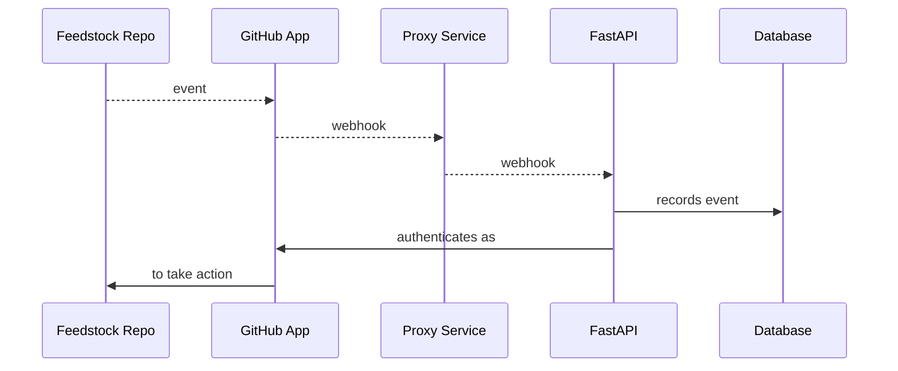

# Development Guide

This combination guide and tutorial walks through setup of a local dev environment,
through making your first PR to `pangeo-forge-orchestrator`.

**Table of Contents**

- [1 Deployment Lifecycle](#1-deployment-lifecycle)
- [2 Getting started: the local deployment](#2-getting-started-the-local-deployment)
  - [2.1 Generating credentials](#21-generating-credentials)
    - [2.1.1 GitHub App](#211-github-app)
    - [2.1.2 FastAPI](#212-fastapi)
  - [2.2 Encrypting & committing creds](#22-encrypting--committing-creds)
    - [2.2.1 Create an age key](#221-create-an-age-key)
    - [2.2.2 Encrypt those creds](#222-encrypt-those-creds)
  - [2.3 Database](#23-database)
  - [2.4 The proxy: selection & setup](#24-the-proxy-selection--setup)
    - [2.4.1 smee vs. ngrok](#241-smee-vs-ngrok)
    - [2.4.2 Start the proxy](#242-start-the-proxy)
      - [Option 1: with smee](#2421-option-1-with-smee)
      - [Option 2: with ngrok](#2422-option-2-with-ngrok)
    - [2.4.2 Update Github App's webhook url](#242-update-github-apps-webhook-url)
  - [2.5 Start the server](#25-start-the-server)
- [3 Sending payloads to `local` deployment]()
  - [3.1 Creating a mock feedstock repo on GitHub]()
    - [3.1.1 Mocking pangeo-forge/staged-recipes]()
    - [3.1.2 Mocking pangeo-forge/dataset-feedstock]()
  - [3.2 Installing the `local` app in a mock feedstock]()
  - [3.3 Triggering events from the mock feedstock]()
  - [3.4 Debugging event webhooks]()
- [4 Adding features: design principles]()
  - [4.1]()
  - [4.2]()
  - [4.3]()
- [5 Next steps: the `review` deployment]()
  - [5.1 Open a PR]()
  - [5.2 Create, encrypt, and commit `review` credentials]()
- [6 Before merge: automated testing]()
  - [6.1 Mocking payloads]()
  - [6.2 Local run]()
    - [6.2.1 sqlite]()
    - [6.3.2 postgres]()
  - [6.3 Containerized run]()
    - [6.3.1 Starting the containerized services]()
    - [6.3.2 Testing on the containerized services]()
- [7 Finally: from `staging` to `prod`]()

# 1 Deployment Lifecycle

Every PR to `pangeo-forge-orchestrator` travels though a series of four deployments.


Each of these deployments requires a set of credentials to run. These are kept in the
`secrets` directory of this repo.

```
...
├── secrets
│   ├── config.local.yaml
│   ├── config.review.yaml
│   ├── config.staging.yaml
│   └── config.prod.yaml
...
```

The user creates and provides `local` and `review` credentials for their PRs, whereas the organization
(i.e., `pangeo-forge`) manages credentials for the `staging` and `prod` deployments.


Credentials for each deployment are commited to the `pangeo-forge-orchestrator` repo as encrypted YAML.
Committing encrypted secrets directly to this repo allows for transparent and version-controlled management
of credentials. [SOPS](https://github.com/mozilla/sops) is used to encrypt and decrypt these files. The
[pre-commit-hook-ensure-sops](https://github.com/yuvipanda/pre-commit-hook-ensure-sops) hook installed in
this repo's `.pre-commit-config.yaml` ensures that we don't accidentally commit unencrypted secrets. For this
reason, please always make sure that [**pre-commit is installed**](https://pre-commit.com/#quick-start)
in your local development environment.

# 2 Getting started: the local deployment

The following sequence diagram illustrates the `local` development environment we will now set up:



In prose, we could describe this sequence as follows: When an event occurs on a **Feedstock Repo** on
GitHub, it is seen by the **GitHub App**(s) installed on that repo. The GitHub App(s) post
information about that event to the **Proxy Service** as a webhook, which forwards those webhooks to
the (locally running) **FastAPI** instance. The FastAPI instance records that event in the database, and
then _authenticates as_ the **GitHub App** to _take an action_ in response to the event on the
**Feedstock Repo**.

> This flow is almost identical to that of the other deployments, with the exception of the Proxy Service,
> which is unique to the `local` deployment.

In what follows, we will work through all of the steps necessary for setting up this development environment.

## 2.1 Generating credentials

Before starting work on your PR, you will need a local deployment of the application to work with. In order to
run this deployment, you will need to generate credentials for a new GitHub App instance, as well as for
FastAPI.

### 2.1.1 GitHub App

[GitHub Apps](https://docs.github.com/en/developers/apps/getting-started-with-apps/about-apps#about-github-apps)
are a mechanism by which third party integrations can receive webhooks and take authenticated
actions on GitHub. Users and organizations can both create GitHub Apps within their accounts. As indicated by
the diagram in [Deployment Lifecycle](#1-deployment-lifecycle), users create and manage credentials for
GitHub Apps associated with their `local` and `review` deployments.

> **Note**: You may be wondering, if this is a `local` deployment, why do I need a _real_ GitHub App at all?
> Shouldn't the `local` deployment run entirely _locally_ on my own machine? This a good question. The answer is
> that while the `pangeo-forge-orchestrator` FastAPI instance will run locally, the easiest and most reliable
> way to generate webhook inputs for your local instance is to connect it (via a "tunnel" or proxy) to a
> corresponding _real_ GitHub App. Without doing this, we must generate mock payloads ourselves, which is a
> time-consuming and potentially error-prone process (insofar as our mock payloads may not perfectly match
> those delivered by a real GitHub event). Ultimately, all features of the `pangeo-forge-orchestrator` app
> should be tested in `pytest` using mock payloads, but during the development process, its easiest not to
> have to simulate these payloads ourselves, which is why we're creating a real GitHub App now.

To authorize creation of a GitHub App instance in your user account for your `local` deployment, first assign
the env var `GITHUB_PAT` to a GitHub [Personal Access Token](https://docs.github.com/en/authentication/keeping-your-account-and-data-secure/creating-a-personal-access-token#creating-a-token)
(with `repo` scope) for your user account:

```console
$ export GITHUB_PAT=${your_personal_access_token}
```

To programmatically create GitHub Apps, GitHub requires authentication via an in-browser oauth flow. The script
we use to create the `local` app instance, therefore, starts a local webserver to walk you through this flow. From the repo root, run:

```console
$ python3 scripts/new_github_app.py $YOUR_GITHUB_USERNAME local
```

You should see the following in your terminal:

```
To authorize a new dev app, navigate to http://localhost:3000/authorize.html
```

Navigate to http://localhost:3000/authorize.html. You should see something like this:


> **Do not** manually edit any of the JSON parameters in the input field; they have been programmatically
> generated for you by `scripts/new_github_app.py`. **_Do_ be aware**, however, that from this point forward
> you will be authorizing creation of a new GitHub App in your _real_ user account. If you have any
> reservations about this, please review `scripts/new_github_app.py` closely and/or dicuss with a Pangeo Forge
> maintainer before proceeding.

If you are ready to create a new GitHub App in your user account, click **Submit**. This button will redirect
you to GitHub, where you may be asked to login (or not, if your browser session credentials are still valid),
and then to a GitHub page which will prompt you to create a new GitHub App in your user account:


Clicking the green button will create the `local` development app, and redirect you to a page like this:


where `/workdir` where will be replaced with the path in which your clone of `pangeo-forge-orchestrator` is stored.

🎉 Congratulations, you've created the GitHub App instance for your `local` deployment.
Navigating to https://github.com/settings/apps should now show you something like this (except
with your username in the app's name):


As indicated by the redirect page screenshotted above, the credentials for this GitHub App,
including a private key and a webhook secret, will now be stored in the
`secrets/config.local.yaml` path within this repo.

This GitHub App will need a little bit more configuration before we can use it, which we will
address in [section 2.4](#24-the-proxy-selection--setup) below. This remaining configuration is
not related to credentials, however, so we will pause on this subject momentarily, and move on
to generating FastAPI credentials.

### 2.1.2 FastAPI

In addition to GitHub App credentials, each deployment requires FastAPI credentials. These are the creds that
are used to authorize protected actions on such as creating, patching, and deleting entries in the database.

To generate these credentials for the `local` deployment, from the repo root, run:

```console
$ python3 scripts/generate_api_key.py local
```

If you look at `secrets/config.local.yaml` now, you should see that creds have been added to it under the
`fastapi` heading.

### 2.2 Encrypting & committing creds

🥇 Great work! You should now have a `secrets/config.local.yaml` with all the credentials required for your
`local` deployment. While it is not strictly necessary to commit these credentials to the repo (because they
are for your local dev environment), this is a good opportunity to practice encrypting credentials (which
_will_ be required for the `review` deployment later on). Moreover, managing all credentials (including for
`local` deployment) in a uniform manner simplifies the process.

> ⚠️ If you have not yet made sure that [**pre-commit is installed**](https://pre-commit.com/#quick-start) in
> your local development environment, now is the time to do so! If you do not install pre-commit,
> [pre-commit-hook-ensure-sops](https://github.com/yuvipanda/pre-commit-hook-ensure-sops) cannot protect you
> from accidentally committing unencrypted credentials.

Assuming you have pre-commit installed (really, ☝️ read the warning above if you haven't already 😄), you will
be protected from committing your (currently unencrypted) credentials:

```console
$ git commit -m "add local config"
Ensure secrets are encrypted with sops...................................Failed
- hook id: sops-encryption
- exit code: 1

secrets/config.local.yaml: sops metadata key not found in file, is not properly encrypted
```

#### 2.2.1 Create an age key

Currently, we use the [`age` backend](https://github.com/mozilla/sops#encrypting-using-age) for SOPS.
To get an `age` encryption key:

1. [Install `age`](https://github.com/FiloSottile/age#installation)
2. Generate your private/public key pair with `age-keygen -o key.txt`
3. Your public key will be printed to stdout, and your private key will be saved to `key.txt`

You can keep your private `key.txt` in the repo root; our `.gitignore` prevents it from being committed. Save
your public key somewhere you'll remember it, and also export it to your local env as `AGE_PUBLIC_KEY`.
For example:

```console
$ export AGE_PUBLIC_KEY=age1xvhtwvxklw0zljmj4flnqyqlnq0cudadnenzcv20snwa90nzqylqzqtlsg
```

#### 2.2.2 Encrypt those creds

1. Install [SOPS](https://github.com/mozilla/sops). The easiest way to do this on Mac is probably
   [`brew install sops`](https://formulae.brew.sh/formula/sops).
2. Set the `SOPS_AGE_RECIPIENTS` env var as follows:
   ```console
   $ export SOPS_AGE_RECIPIENTS=$(cat age-recipients.txt),${AGE_PUBLIC_KEY}
   ```
   This will ensure that you will be able to decrypt this file (because `AGE_PUBLIC_KEY` is your public key),
   and that Pangeo Forge admins (whose public key is stored in `age-recipients.txt`) will also be able to
   decrypt it.
3. From the repo root, run:
   ```console
   $ sops -e -i secrets/config.local.yaml
   ```
   The `-e` indicates `encrypt` and the `-i` is for "in place".

Your credentials are now encrypted! You can commit them to the repo now. We will revisit how to decrypt them
before [starting the dev server](#25-start-the-server) below.

## 2.3 Database

You will not be able to start your `local` dev server without first setting the `DATABASE_URL` env variable,
which tells the application where to connect to the database.

By far the easiest way to do this is by using a sqlite database, as follows:

```console
$ export DATABASE_URL=sqlite:///`pwd`/database.sqlite
```

The file `database.sqlite` does not need to exist before you start the application; the application will
create it for you on start-up. Note that of the four deployments described in the
[Deployment Lifecycle](#1-deployment-lifecycle) section above, the `local` deployment is the only once which
can use sqlite. All of the others use postgres:

|          | local | review | staging | prod |
| -------- | ----- | ------ | ------- | ---- |
| sqlite   | ✅    | ✖️     | ✖️      | ✖️   |
| postgres | ✅    | ✅     | ✅      | ✅   |

As noted by this table, the `local` deployment _can_ also run with postgres. This may be useful for
debugging issues related to postgres specifically. (The sqlite and postgres idioms, while similar, are
different enough that code developed _only_ against sqlite can sometimes fail against postgres.)

> **TODO**: Move postgres setup documentation from top level README to here? Or otherwise link to it.

# 2.4 The proxy: selection & setup

## 2.4.1 smee vs. ngrok

Next, you will need to start a new proxy for your local application instance. Two choices are:

| Proxy service     | ✅ Pros                                                                                 | ❌ Cons                                                              |
| ----------------- | --------------------------------------------------------------------------------------- | -------------------------------------------------------------------- |
| https://smee.io   | <li>Light weight</li><li>Faster to setup</li><li>Persistent url without paid plan</li>  | No birectional communication (only forwards webhooks).               |
| https://ngrok.com | Birectional communication (forwards webhooks _and_ allows querying _any_ route on app). | <li>Slightly more setup</li><li>No persistent urls on free plan</li> |

Both of these services are endorsed by the official GitHub docs. The choice may be partially stylistic, and
partially dependent on what aspect of the the application you are planning to work on. Either way, you will need
to:

- Generate a proxy url via your selected service
- Install and start the local client service for your proxy url

> **Note**: In smee, these ☝️ are two separate steps. In ngrok (with the free plan), starting the client
> generates the proxl url, so these two steps are combined into one. We'll discuss this in the next section.

## 2.4.2 Start the proxy

### 2.4.2.1 Option 1: with smee

Navigate to https://smee.io/ and click **Start a new channel**. Smee will generate a your proxy url for you,
which will look something like this: https://smee.io/pGKLaDu6CJwiBjJU.

> Smee is _only a webhook forwarding service_, therefore you do not append the `/github/hooks/` route to the proxy url; this route is specified by the `--path` option when starting the `smee` client.

Assign your smee proxy as, e.g.:

```console
$ export PROXY_URL=https://smee.io/pGKLaDu6CJwiBjJU
```

Navigating to your smee proxy url in a browser will provide you instructions for installing the smee command
line utility. Install it, then start the smee client with:

```console
$ smee -u $PROXY_URL -p 8000 --path /github/hooks/
```

where `-p` is the localhost port you plan to serve FastAPI on, and `--path` is the route to which GitHub
App webhooks are posted.

> Note: I believe smee sends a ping test to the url when the client starts? If so this ping test will fail
> because we have not finished setting up our dev environment. But we don't need to worry about this for now.
> It's just a ping test, which we can repeat later once everything is setup and running.

### 2.4.2.2 Option 2: with ngrok

To use ngrok, follow the instructions in https://ngrok.com/docs/getting-started to install and authenticate
your ngrok account. Then start a local ngrok client with:

```console
$ ngrok http 8000
```

You should see a terminal window such as:

```console
ngrok                                                                                               (Ctrl+C to quit)

Hello World! https://ngrok.com/next-generation

Session Status                online
Account                       Charles Stern (Plan: Free)
Update                        update available (version 3.0.7, Ctrl-U to update)
Version                       3.0.6
Region                        United States (us)
Latency                       -
Web Interface                 http://127.0.0.1:4040
Forwarding                    https://d584-2603-8001-7403-8c5d-65ac-51ae-6801-5986.ngrok.io -> http://localhost:8000

Connections                   ttl     opn     rt1     rt5     p50     p90
                              0       0       0.00    0.00    0.00    0.00
```

the long url listed after `Forwarding` is your proxy url. In this case, it would be :
https://d584-2603-8001-7403-8c5d-65ac-51ae-6801-5986.ngrok.io.

Ngrok exposes _your entire locally running app_ over the public internet. You _do_, therefore, need to append
the `/github/hooks/` route to this url, because routes on this service correspond to the actual routes on your
app. You would therefore assign your proxy url as, e.g.:

```console
$ export PROXY_URL=https://28ae-2603-8001-7403-8c5d-65ac-51ae-6801-5986.ngrok.io/github/hooks/
```

> ☝️ See how we've appended `/github/hooks/` to the ngrok proxy url, but not the smee url? That's important!
> Overlooking this difference in how smee & ngrok behave can lead to confusion and a broken dev environment.

Ngrok urls do not persist between client sessions on the free plan, so closing this window will reset your
proxy url. We need this url to be persistent at least within a single development session, therefore leave
ngrok running for the duration of your development session.

> The lack of persitent urls on ngrok's free plan makes it a slightly higher friction choice. The support
> for bidirection communication (POSTing webhooks, and GETing data back) is very useful, however, and may be
> worth the friction for certain development tasks.

## 2.4.2 Update GitHub App's webhook url

We will need `pangeo-forge-orchestrator` installed to run the final setup script below. If you have not done so
already, from the repo root, run:

```console
$ pip install -e ".[dev]"
```

Running the next script will require your GitHub App credentials, which if you've been following this guide
sequentially are still encrypted. To decrypt them, from the repo root, run:

```console
$ SOPS_AGE_KEY=$(cat key.txt) sops -d -i secrets/config.local.yaml
```

Then, using the proxy url you generated in [section 2.4.1](#241-smee-vs-ngrok) as `PROXY_URL`, run:

```console
$ python3 scripts/update_hook_url.py local $PROXY_URL
```

If this script succeeds, you will get a response to stdout such as:

```
200 {"content_type":"json","secret":"********","url":"https://smee.io/pGKLaDu6CJwiBjJU","insecure_ssl":"0"}
```

where the `"url"` field should be updated to refect the `PROXY_URL` you passed to the script.

🎊 Your GitHub App will now POST webhooks to the specified proxy url. You can change your proxy url at any
time. If you do, repeat this step to assign the new url to your GitHub App.

# 2.5 Start the server
