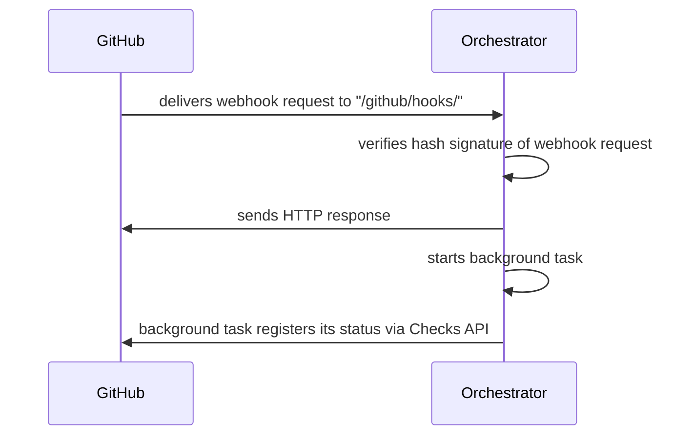

You should see the following in your terminal:

```
To authorize a new dev app, navigate to http://localhost:3000/authorize.html
```

Navigate to http://localhost:3000/authorize.html. You should see something like this:


> **Do not** manually edit any of the JSON parameters in the input field; they have been programmatically
> generated for you by `scripts/new_github_app.py`. **_Do_ be aware**, however, that from this point forward
> you will be authorizing creation of a new GitHub App in your _real_ user account. If you have any
> reservations about this, please review `scripts.develop/new_github_app.py` closely and/or dicuss with a Pangeo Forge
> maintainer before proceeding.

If you are ready to create a new GitHub App in your user account, click **Submit**. This button will redirect
you to GitHub, where you may be asked to login (or not, if your browser session credentials are still valid),
and then to a GitHub page which will prompt you to create a new GitHub App in your user account:


Clicking the green button will create the `local` development app, and redirect you to a page like this:


where `/workdir` will be replaced with the path in which your clone of `pangeo-forge-orchestrator` is stored.

🎉 Congratulations, you've created the GitHub App instance for your `local` deployment.
Navigating to https://github.com/settings/apps should now show you something like this (except
with your username in the app's name):


As indicated by the redirect page screenshotted above, the credentials for this GitHub App,
including a private key and a webhook secret, will now be stored in the
`secrets/config.local.yaml` path within this repo.

This GitHub App will need a little bit more configuration before we can use it, which we will
address in [section 2.4](#24-the-proxy-selection--setup) below. This remaining configuration is
not related to credentials, however, so we will pause on this subject momentarily, and move on
to generating FastAPI credentials.

# 2.4 The proxy: selection & setup

## 2.4.1 smee vs. ngrok

Next, you will need to start a new proxy for your local application instance. Two choices are:

| Proxy service     | ✅ Pros                                                                                 | ❌ Cons                                                              |
| ----------------- | --------------------------------------------------------------------------------------- | -------------------------------------------------------------------- |
| https://smee.io   | <li>Light weight</li><li>Faster to setup</li><li>Persistent url without paid plan</li>  | No birectional communication (only forwards webhooks).               |
| https://ngrok.com | Birectional communication (forwards webhooks _and_ allows querying _any_ route on app). | <li>Slightly more setup</li><li>No persistent urls on free plan</li> |

Both of these services are endorsed by the official GitHub docs. The choice may be partially stylistic, and
partially dependent on what aspect of the the application you are planning to work on. Either way, you will need
to:

- Generate a proxy url via your selected service
- Install and start the local client service for your proxy url

> **Note**: In smee, these ☝️ are two separate steps. In ngrok (with the free plan), starting the client
> generates the proxl url, so these two steps are combined into one. We'll discuss this in the next section.

## 2.4.2 Start the proxy

### 2.4.2.1 Option 1: with smee

## 2.4.3 Update GitHub App's webhook url

We will need `pangeo-forge-orchestrator` installed to run the final setup script below. If you have not done so
already, from the repo root, run:

```console
$ pip install -e ".[dev]"
```

Running the next script will require your GitHub App credentials, which if you've been following this guide
sequentially are still encrypted. To decrypt them, from the repo root, run:

```console
$ sops -d -i secrets/config.local.yaml
```

Then, using the proxy url you generated in [section 2.4.1](#241-smee-vs-ngrok) as `PROXY_URL`, run:

# 2.6 Start the FastAPI server

In addition to the pre-requistes listed in the [recap](#25-interlude-recap) above, before starting the FastAPI server, you'll need to ensure that:

1. Your creds are decrypted:

   ```console
   $ sops -d -i secrets/config.local.yaml
   ```

2. You have `pangeo-forge-orchestrator` installed:
   ```console
   $ pip install -e ".[dev]"
   ```

> Both of these commands are run from the repo root. If you've been following this tutorial sequentially, you
> will have already done both of these things. You may be referring back to this section out-of-order, however,
> in which case this reminder may be helpful.

To start the FastAPI dev server in reload mode (recommended), from the repo root, run:

```console
$ uvicorn pangeo_forge_orchestrator.api:app --reload --reload-dir=`pwd`/pangeo_forge_orchestrator
```

You should see something like:

```
INFO:     Will watch for changes in these directories: ['/workdir/pangeo-forge-orchestrator/pangeo_forge_orchestrator']
INFO:     Uvicorn running on http://127.0.0.1:8000 (Press CTRL+C to quit)
INFO:     Started reloader process [57722] using StatReload
INFO:     Started server process [57727]
INFO:     Waiting for application startup.
INFO:     Application startup complete.
```

where `/workdir` will be replaced with the path in which your clone of `pangeo-forge-orchestrator` is stored.

Make sure that this server is running on localhost port `8000` (as shown in the example above). If it's run
on a different port, the [proxy client we started above](#242-start-the-proxy) will not forward webhooks to
it.

# 3 Triggering webhooks

🌟 Congratulations! You now have a locally running instance of FastAPI. Navigating to http://localhost:8000,
you should see:

```
{"status":"ok"}
```

And http://localhost:8000/docs should show you the autogenerated docs for the app.

In order to start sending webhooks to your local deployment, we need _somewhere to send webhooks from_. In
Pangeo Forge, all events originate from feedstock repositories on GitHub, so we will make one of those now.

## 3.1 Creating a mock feedstock repo on GitHub

To send webhooks to our local deployment, we'll need to create at least one feedstock repo on GitHub. As noted
in [section 2.1.1](#211-github-app), sending webhooks from a real GitHub repo is the most reliable way to
simulate what will happen in a production context.

There are two types of feedstocks in Pangeo Forge:

1. `pangeo-forge/staged-recipes`: The special case feedstock repo used for staging new feedstocks.
2. `pangeo-forge/dataset-feedstock`: The typical feedstock repo, which manages a particular recipe or set
   of recipes for a given dataset.

Depending on what aspects of the application you plan to work on, you may want to simulate only one of these
two types of feedstock in your personal account, or perhaps you will want to simulate both.

To simulate staged-recipes, create a new repo in your user account called `your-username/mock-staged-recipes` or similar.

To simulate a dataset feedstock, create a new repo in your user called `your-username/mock-dataset-feedstock`
or similar.

For consistency with the Pangeo Forge project, it's **recommended to use the Apache 2.0 license** for these
repositories.

## 3.2 Installing GitHub App in a mock feedstock

To install your GitHub App on your simulated (i.e. mock) feedstock repo(s):

1. Navigate to https://github.com/settings/apps
2. Click the the image next to the app named `pforge-local-your-username`, where your-username is your GitHub
   username. If this app does not exist, restart this tutorial from [section 2.1.1](#211-github-app) to create it.
3. You should now be on a page with the url https://github.com/settings/apps/pforge-local-your-username,
   where `your-username` is your GitHub username.
4. Click **Install App** in the menu on the lefthand side of the page.
5. Click **Install** next to your username:
   
6. On the next page, choose **Only select repositories**, and specify the repo(s) you created in
   [section 3.1](#31-creating-a-mock-feedstock-repo-on-github):
   
7. Click **Install** to complete the installation

## 3.4 Triggering a webhook

To trigger a webhook on a feedstock repo via the installed GitHub App, we simply need to initiate the
appropriate action within that repository on GitHub.

> **IMPORTANT**: The GitHub App will only see events to which it has been subscribed. These events are
> defined in the `manifest` dict's `default_events` key in `scripts/new_github_app.py`. You can manually
> subscribe your installed GitHub App instance to additional events under the **Subscribe to events**
> header of https://github.com/settings/apps/your-github-app-name/permissions. If you do so, please note:
>
> 1. After configuring additional subscriptions, will need to grant the _installation of your app_ on
>    your mock feedstock repo(s) permission to activate these new subscriptions.
> 2. If you would like to propose these additional subscriptions to be part of the production GitHub App,
>    please add them to the `manifest` dict's `default_events` key in `scripts/new_github_app.py`.

An event that we know the GitHub App is subscribed to is `"pull_request"`, so we can practice triggering
a webhook by opening a pull request against a mock feedstock repo. Go ahead and open PR (containing any
content whatsoever) against one of the feedstock repos listed at http://localhost:8000/feedstocks.

## 3.5 Finding webhook delivery metadata

Once you've opened a PR against one of the repos listed at http://localhost:8000/feedstocks, the GitHub App
installed in that repo will delivery a webhook to its configured webhook url. (We set this webhook url in
[section 2.4.3](#243-update-github-apps-webhook-url).)

### 3.5.1 via GitHub App in-browser UI

You can introspect (and redeliver!) webhooks for your app at https://github.com/settings/apps/your-github-app-name/advanced. Under the **Recent Deliveries** header, you will see a listing such as:


Clicking the `...` icon to the right of any of these listings will reveal more information and options:


🚨 **Super-useful feature alert**: 🚨 See that **Redeliver** button in the screenshot above? ☝️ You can
use that to re-send any webhook. This is very useful for repeating the same input to your FastAPI
deployment repeatedly, without having to re-create the inciting event (i.e., open a new PR, etc.).

### 3.5.2 via GitHub REST API

The same information available via GitHub's in-browser UI is also available via the GitHub REST API:

- https://docs.github.com/en/rest/apps/webhooks#list-deliveries-for-an-app-webhook
- https://docs.github.com/en/rest/apps/webhooks#get-a-delivery-for-an-app-webhook

But wait! If you'd like to fetch this data programmatically, you **don't have to go to GitHub** for it.
See the next section for how to retrieve this same data via your local FastAPI deployment.

### 3.5.3 via FastAPI `/deliveries` routes

The two GitHub REST API endpoints listed in the previous section are sufficiently useful, that they are
also piped through our FastAPI application, so we can access them there directly.

- `/feedstocks/{id}/deliveries`: A list of webhook deliveries for a particular feedstock repo is available
  here. For example, on my local deployment, http://localhost:8000/feedstocks/1/deliveries returns:

      ```
      [{"id":25585324505,"guid":"dfdabc30-24b8-11ed-8d20-b5bb826f8e78","delivered_at":"2022-08-25T21:01:28Z","redelivery":false,"duration":0.03,"status":"OK","status_code":200,"event":"check_suite","action":"requested","installation_id":28593384,"repository_id":479544328,"url":""},{"id":25585288183,"guid":"f6b3bbf0-24b8-11ed-8474-a48ef024b2b3","delivered_at":"2022-08-25T21:01:06Z","redelivery":false,"duration":0.04,"status":"OK","status_code":200,"event":"pull_request","action":"opened","installation_id":28593384,"repository_id":479544328,"url":""},{"id":25585280045,"guid":"f1d5b390-24b8-11ed-9641-0436067a0d00","delivered_at":"2022-08-25T21:01:02Z","redelivery":false,"duration":0.03,"status":"OK","status_code":200,"event":"check_suite","action":"requested","installation_id":28593384,"repository_id":479544328,"url":""}]
      ```

- `/github/hooks/deliveries/{id}`: Abbreviated details about a particular delivery can be found by appending
  the delivery `"id"` (see example JSON above) to the path; e.g., on my local instance,
  http://localhost:8000/github/hooks/deliveries/25585324505 returns:

      ```
      {"headers":{"Access-Control-Allow-Origin":"*","Content-Length":"0","Date":"Thu, 25 Aug 2022 21:01:28 GMT","Request-Context":"appId=cid-v1:dbf2521b-ad66-4c2b-9039-e77861d2553c","Set-Cookie":"ARRAffinity=bbedefcaaa308b8e8a864b2c46ce165b5eac501f4727d23e7f1ba714332db248;Path=/;HttpOnly;Secure;Domain=smee.io","X-Powered-By":"Express"},"payload":""}
      ```

- `/github/hooks/deliveries/{id}?response_only=false`The un-abbreviated, full payload for the webhook is
  available via the query parameter. For example, on my deployment,
  http://localhost:8000/github/hooks/deliveries/25585324505?response_only=false returns:

      ```
      {"id":25585324505,"guid":"dfdabc30-24b8-11ed-8d20-b5bb826f8e78","delivered_at":"2022-08-25T21:01:28Z","redelivery":false,"duration":0.03,"status":"OK","status_code":200,"event":"check_suite","action":"requested","installation_id":28593384,"repository_id":479544328,"url":"https://smee.io/pGKLaDu6CJwiBjJU","request":{"headers":{"Accept":"*/*","User-Agent":"GitHub-Hookshot/243c8c5","X-GitHub-Delivery":"dfdabc30-24b8-11ed-8d20-b5bb826f8e78","X-GitHub-Event":"check_suite","X-GitHub-Hook-ID":"375692500","X-GitHub-Hook-Installation-Target-ID":"231585","X-GitHub-Hook-Installation-Target-Type":"integration","X-Hub-Signature":"sha1=1812616717cac2406ce321d6c0896dc1068c2143","X-Hub-Signature-256":"sha256=77feceb31539a8e827fee5592e4e2bea033595e6502fa97850adc1e0096745ea","content-type":"application/json"},"payload":{"action":"requested","check_suite":{"id":7987826801,"node_id":"CS_kwDOHJVECM8AAAAB3ByQcQ","head_branch":"main","head_sha":"82e2967869fa35958e190c13c1588e1b8685938b","status":"queued","conclusion":null,"url":"https://api.github.com/repos/cisaacstern/mock-dataset-feedstock/check-suites/7987826801","before":"00c77d71f0497ad83f7337c7c96d72412b3b5a69","after":"82e2967869fa35958e190c13c1588e1b8685938b","pull_requests":[],"app":{"id":231585,"slug":"pforge-local-cisaacstern","node_id":"A_kwDOA7T6O84AA4ih","owner":{"login":"cisaacstern","id":62192187,"node_id":"MDQ6VXNlcjYyMTkyMTg3","avatar_url":"https://avatars.githubusercontent.com/u/62192187?v=4","gravatar_id":"","url":"https://api.github.com/users/cisaacstern","html_url":"https://github.com/cisaacstern","followers_url":"https://api.github.com/users/cisaacstern/followers","following_url":"https://api.github.com/users/cisaacstern/following{/other_user}","gists_url":"https://api.github.com/users/cisaacstern/gists{/gist_id}","starred_url":"https://api.github.com/users/cisaacstern/starred{/owner}{/repo}","subscriptions_url":"https://api.github.com/users/cisaacstern/subscriptions","organizations_url":"https://api.github.com/users/cisaacstern/orgs","repos_url":"https://api.github.com/users/cisaacstern/repos","events_url":"https://api.github.com/users/cisaacstern/events{/privacy}","received_events_url":"https://api.github.com/users/cisaacstern/received_events","type":"User","site_admin":false},"name":"pforge-local-cisaacstern","description":"A development version of the pangeo-forge github app.","external_url":"https://pangeo-forge.org/","html_url":"https://github.com/apps/pforge-local-cisaacstern","created_at":"2022-08-24T19:22:34Z","updated_at":"2022-08-24T19:22:34Z","permissions":{"administration":"write","checks":"write","contents":"write","deployments":"write","issues":"read","metadata":"read","pull_requests":"write"},"events":["issue_comment","pull_request"]},"created_at":"2022-08-25T20:59:56Z","updated_at":"2022-08-25T20:59:56Z","rerequestable":true,"runs_rerequestable":true,"latest_check_runs_count":0,"check_runs_url":"https://api.github.com/repos/cisaacstern/mock-dataset-feedstock/check-suites/7987826801/check-runs","head_commit":{"id":"82e2967869fa35958e190c13c1588e1b8685938b","tree_id":"9cd18e7627271e2e392de85580fe1c30b2caec9f","message":"Update recipe.py","timestamp":"2022-08-25T20:59:55Z","author":{"name":"Charles Stern","email":"62192187+cisaacstern@users.noreply.github.com"},"committer":{"name":"GitHub","email":"noreply@github.com"}}},"repository":{"id":479544328,"node_id":"R_kgDOHJVECA","name":"mock-dataset-feedstock","full_name":"cisaacstern/mock-dataset-feedstock","private":false,"owner":{"login":"cisaacstern","id":62192187,"node_id":"MDQ6VXNlcjYyMTkyMTg3","avatar_url":"https://avatars.githubusercontent.com/u/62192187?v=4","gravatar_id":"","url":"https://api.github.com/users/cisaacstern","html_url":"https://github.com/cisaacstern","followers_url":"https://api.github.com/users/cisaacstern/followers","following_url":"https://api.github.com/users/cisaacstern/following{/other_user}","gists_url":"https://api.github.com/users/cisaacstern/gists{/gist_id}","starred_url":"https://api.github.com/users/cisaacstern/starred{/owner}{/repo}","subscriptions_url":"https://api.github.com/users/cisaacstern/subscriptions","organizations_url":"https://api.github.com/users/cisaacstern/orgs","repos_url":"https://api.github.com/users/cisaacstern/repos","events_url":"https://api.github.com/users/cisaacstern/events{/privacy}","received_events_url":"https://api.github.com/users/cisaacstern/received_events","type":"User","site_admin":false},"html_url":"https://github.com/cisaacstern/mock-dataset-feedstock","description":"A Pangeo Forge Feedstock for mock-dataset.","fork":false,"url":"https://api.github.com/repos/cisaacstern/mock-dataset-feedstock","forks_url":"https://api.github.com/repos/cisaacstern/mock-dataset-feedstock/forks","keys_url":"https://api.github.com/repos/cisaacstern/mock-dataset-feedstock/keys{/key_id}","collaborators_url":"https://api.github.com/repos/cisaacstern/mock-dataset-feedstock/collaborators{/collaborator}","teams_url":"https://api.github.com/repos/cisaacstern/mock-dataset-feedstock/teams","hooks_url":"https://api.github.com/repos/cisaacstern/mock-dataset-feedstock/hooks","issue_events_url":"https://api.github.com/repos/cisaacstern/mock-dataset-feedstock/issues/events{/number}","events_url":"https://api.github.com/repos/cisaacstern/mock-dataset-feedstock/events","assignees_url":"https://api.github.com/repos/cisaacstern/mock-dataset-feedstock/assignees{/user}","branches_url":"https://api.github.com/repos/cisaacstern/mock-dataset-feedstock/branches{/branch}","tags_url":"https://api.github.com/repos/cisaacstern/mock-dataset-feedstock/tags","blobs_url":"https://api.github.com/repos/cisaacstern/mock-dataset-feedstock/git/blobs{/sha}","git_tags_url":"https://api.github.com/repos/cisaacstern/mock-dataset-feedstock/git/tags{/sha}","git_refs_url":"https://api.github.com/repos/cisaacstern/mock-dataset-feedstock/git/refs{/sha}","trees_url":"https://api.github.com/repos/cisaacstern/mock-dataset-feedstock/git/trees{/sha}","statuses_url":"https://api.github.com/repos/cisaacstern/mock-dataset-feedstock/statuses/{sha}","languages_url":"https://api.github.com/repos/cisaacstern/mock-dataset-feedstock/languages","stargazers_url":"https://api.github.com/repos/cisaacstern/mock-dataset-feedstock/stargazers","contributors_url":"https://api.github.com/repos/cisaacstern/mock-dataset-feedstock/contributors","subscribers_url":"https://api.github.com/repos/cisaacstern/mock-dataset-feedstock/subscribers","subscription_url":"https://api.github.com/repos/cisaacstern/mock-dataset-feedstock/subscription","commits_url":"https://api.github.com/repos/cisaacstern/mock-dataset-feedstock/commits{/sha}","git_commits_url":"https://api.github.com/repos/cisaacstern/mock-dataset-feedstock/git/commits{/sha}","comments_url":"https://api.github.com/repos/cisaacstern/mock-dataset-feedstock/comments{/number}","issue_comment_url":"https://api.github.com/repos/cisaacstern/mock-dataset-feedstock/issues/comments{/number}","contents_url":"https://api.github.com/repos/cisaacstern/mock-dataset-feedstock/contents/{+path}","compare_url":"https://api.github.com/repos/cisaacstern/mock-dataset-feedstock/compare/{base}...{head}","merges_url":"https://api.github.com/repos/cisaacstern/mock-dataset-feedstock/merges","archive_url":"https://api.github.com/repos/cisaacstern/mock-dataset-feedstock/{archive_format}{/ref}","downloads_url":"https://api.github.com/repos/cisaacstern/mock-dataset-feedstock/downloads","issues_url":"https://api.github.com/repos/cisaacstern/mock-dataset-feedstock/issues{/number}","pulls_url":"https://api.github.com/repos/cisaacstern/mock-dataset-feedstock/pulls{/number}","milestones_url":"https://api.github.com/repos/cisaacstern/mock-dataset-feedstock/milestones{/number}","notifications_url":"https://api.github.com/repos/cisaacstern/mock-dataset-feedstock/notifications{?since,all,participating}","labels_url":"https://api.github.com/repos/cisaacstern/mock-dataset-feedstock/labels{/name}","releases_url":"https://api.github.com/repos/cisaacstern/mock-dataset-feedstock/releases{/id}","deployments_url":"https://api.github.com/repos/cisaacstern/mock-dataset-feedstock/deployments","created_at":"2022-04-08T21:33:54Z","updated_at":"2022-04-08T21:34:01Z","pushed_at":"2022-08-25T20:59:55Z","git_url":"git://github.com/cisaacstern/mock-dataset-feedstock.git","ssh_url":"git@github.com:cisaacstern/mock-dataset-feedstock.git","clone_url":"https://github.com/cisaacstern/mock-dataset-feedstock.git","svn_url":"https://github.com/cisaacstern/mock-dataset-feedstock","homepage":null,"size":18,"stargazers_count":0,"watchers_count":0,"language":"Python","has_issues":true,"has_projects":true,"has_downloads":true,"has_wiki":true,"has_pages":false,"forks_count":0,"mirror_url":null,"archived":false,"disabled":false,"open_issues_count":1,"license":{"key":"apache-2.0","name":"Apache License 2.0","spdx_id":"Apache-2.0","url":"https://api.github.com/licenses/apache-2.0","node_id":"MDc6TGljZW5zZTI="},"allow_forking":true,"is_template":false,"web_commit_signoff_required":false,"topics":[],"visibility":"public","forks":0,"open_issues":1,"watchers":0,"default_branch":"main"},"sender":{"login":"cisaacstern","id":62192187,"node_id":"MDQ6VXNlcjYyMTkyMTg3","avatar_url":"https://avatars.githubusercontent.com/u/62192187?v=4","gravatar_id":"","url":"https://api.github.com/users/cisaacstern","html_url":"https://github.com/cisaacstern","followers_url":"https://api.github.com/users/cisaacstern/followers","following_url":"https://api.github.com/users/cisaacstern/following{/other_user}","gists_url":"https://api.github.com/users/cisaacstern/gists{/gist_id}","starred_url":"https://api.github.com/users/cisaacstern/starred{/owner}{/repo}","subscriptions_url":"https://api.github.com/users/cisaacstern/subscriptions","organizations_url":"https://api.github.com/users/cisaacstern/orgs","repos_url":"https://api.github.com/users/cisaacstern/repos","events_url":"https://api.github.com/users/cisaacstern/events{/privacy}","received_events_url":"https://api.github.com/users/cisaacstern/received_events","type":"User","site_admin":false},"installation":{"id":28593384,"node_id":"MDIzOkludGVncmF0aW9uSW5zdGFsbGF0aW9uMjg1OTMzODQ="}}},"response":{"headers":{"Access-Control-Allow-Origin":"*","Content-Length":"0","Date":"Thu, 25 Aug 2022 21:01:28 GMT","Request-Context":"appId=cid-v1:dbf2521b-ad66-4c2b-9039-e77861d2553c","Set-Cookie":"ARRAffinity=bbedefcaaa308b8e8a864b2c46ce165b5eac501f4727d23e7f1ba714332db248;Path=/;HttpOnly;Secure;Domain=smee.io","X-Powered-By":"Express"},"payload":""}}
      ```

  Introspecting these details can be useful for:

1. Ensuring that a webhook was actually sent for a given event
2. Introspecting exactly what data (headers, content, structure, etc.) was sent for a given event

The latter of these two point is particularly useful for figuring out how to parse the payloads once they
arrive in the FastAPI app. More on that in [section 3.6](#36-where--how-are-webhook-deliveries-received) below.
Now let's take a look at two other places to track down information about deliveries.

### 3.5.4 via proxy service

Each of the proxy servies recommended in [section 2.4](#24-the-proxy-selection--setup) provide in-browser
dashboards for tracking and redelivering webhooks. Refer to the official docs of those proxy services for
details.

### 3.5.5 via FastAPI server logs

If the webhook delivery successfully passed through the proxy service to your local FastAPI server, the
terminal window running the server should show a log message such as:

```
INFO:     140.82.115.89:50797:0 - "POST /github/hooks/ HTTP/1.1" 202 Accepted
```

Note, however, that the message may not be `202 Accepted`.

## 3.6 Where & how are webhook deliveries received?

Webhooks are POSTed to the `/github/hooks/` route. On a public deployment of the FastAPI app (i.e., a `review`,
`staging`, or `prod` deployment), webhooks are posted to this route directly. On a `local` deployment, they are
forwarded to this route by the proxy service. The handler for the `/github/hooks/` route is a function defined
in `/pangeo_forge_orchestrator/routers/github_app.py`.

### 3.6.2 Checking event and action types

After the hash signature is verified, the event and action types (passed in the request header and body,
respectively) are evaluated to assess what action should be taken in response. This follows best practices
described in:

> https://docs.github.com/en/github-ae@latest/rest/guides/best-practices-for-integrators#check-the-event-type-and-action-before-processing-the-event

### 3.6.3 Maybe create background task

If the combination of event and action types warrant an action to be taken in response, that action
is assigned to a FastAPI [background task](https://fastapi.tiangolo.com/tutorial/background-tasks/).
This diagram illustrates the complete sequence of events, from receipt of a valid GitHub webhook,
through hash signature verification, to creation of the background task:



More detail on implementation of background tasks (including interaction with the Checks API, as alluded to
in the diagram above) is provided in the next section.

# 4 Adding features: design principles

# 5 Interlude: Calling the GitHub API directly, as your GitHub App

### 5.3 Call the API

# 6 Next steps: the `review` deployment

## 6.1 Open a PR

https://pangeo-forge-api-pr-80.herokuapp.com will be broken

## 6.2 Create, encrypt, and commit `review` credentials

1. Run `scripts/new_github_app.py` with the arguments `GITHUB_USERNAME review PR_NUMBER`. For example,
   for GitHub username `cisaacstern`, with PR number `80`, the script would be called like this:
   `console $ python3 scripts/new_github_app.py cisaacstern review 80 `
2. Follow in-browser prompts to create a new GitHub App.
3. Add FastAPI creds for the `review` app:
   ```console
   $ python3 scripts/generate_api_key.py review
   ```
4. Encrypt the creds:

   ```
   sops -e -i secrets/config.review.yaml
   ```

5. Commit the encrypted `secrets/config.review.yaml` and push it to your PR branch.

   > Note: If your local creds are still decrypted, you might want to just:
   >
   > ```console
   > $ git add secrets/config.review.yaml
   > ```

## 6.3 Check the `review` deployment

On the PR discussion thread you should see a notification that the review app deployment is "pending".
When the review app deployment is complete, you will see something like this:


Click **View deployment**, which will bring you to a url such as https://pangeo-forge-api-pr-80.herokuapp.com.

Confirm that the root path of the deployment displays:

```
{"status":"ok"}
```

If the deployment displays another message, such as "Application error", the deployment has failed.
Confirm that you have correctly created, encrypted, and committed your `secrets/config.review.yaml`
file, as described above. If you believe the issue is not with the review app credentials, or need

## 6.4 Complete GitHub App setup

### 6.4.1 Update webhook url

### 6.4.2 Install app in your mock feedstock(s)

> TODO: Add feature for filtering based on GitHub PR labels. Otherwise we either:
>
> - need separate feedstock repos for each app version we're testing.
> - or will get duplicate responses to each repo.

## 6.6 Initialize `review` database

## 6.7 Trigger a webhook

## manually editing the database

```python
import os
import json
import requests
from pangeo_forge_orchestrator.config import get_fastapi_config

os.environ["PANGEO_FORGE_DEPLOYMENT"] = "pforge-pr-136"
app_address = "https://pforge-pr-136.herokuapp.com"
headers = {
    "X-API-Key": get_fastapi_config().PANGEO_FORGE_API_KEY,
    "accept": "application/json",
    "Content-Type": "application/json",
}

data = {"spec": "pangeo-forge/staged-recipes"}

response = requests.post(
    f"{app_address}/feedstocks/",
    headers=headers,
    data=json.dumps(data),
)
response.status_code  # --> 200
response.json()  # -->  {'spec': 'pangeo-forge/staged-recipes', 'provider': 'github', 'id': 1}
```
