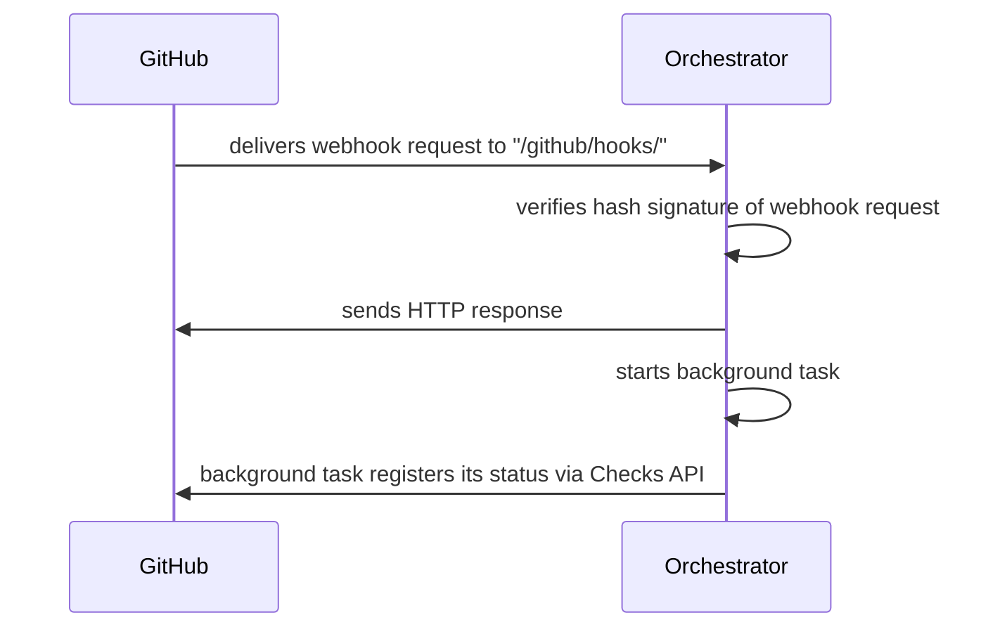

# GitHub App

Advantages of GitHub App:

- More robust auth story
- Single point of configuration for webhooks and taking authenticated actions

> **Example**: How do we provide users with narrowly-scoped admin access to their feedstock repos?
> Conda Forge counter-example: using GitHub Teams? Permissions on the team level.

## Setup a development environment

A little bit involved. To preview we'll set up:

- A new GitHub App
- A sandbox repository on your personal GitHub account in which to install the GitHub App
- A local smee client
- A local FastAPI instance

With these four components set up, you have everything you need to run Pangeo Forge.

> Dataflow development requires additional credentials. Maybe if its a development app, we
> can add special args to use the `pangeo-forge-runner` direct runner, rather than Dataflow?

### Create a new dev app

1. Navigate to https://smee.io/, and create a new smee channel. Also create a GitHub Personal Access Token (PAT) with `repo` scope (TODO: Confirm this is the correct scope). Export both to your local env as:

   ```console
   export SMEE_URL=https://smee.io/brlCfGukG7f5BXv
   export GITHUB_PAT=ghs_abc123..etc.
   ```

2. From repo root, run
   ```console
   python3 scripts/new_dev_app.py $SMEE_URL
   ```
3. Navigate to http://localhost:3000/authorize.html and click **Submit**
4. Follow the unscreen prompts to authorize a GitHub App to be created in your user account
5. You may now `Ctrl+C` out of the webserver process started by `scripts/new_dev_app.py`
6. Your app config (including secrets) will be saved to `secrets/config.dev.yaml`

> A note on `scripts/new_dev_app.py`... why is it so complicated? The only way to make a GitHub App
> instance _from a manifest_ is to use a web browser, for authentication.

### Add api keys to your dev app config

```console
python3 scripts/generate_api_key.py
```

### Create a sandbox repository

1. Create a repository on your personal account. This can have any name, maybe `mock-staged-recipes`
2. Follow the GitHub [docs for installing your newly created GitHub App on your own account](https://docs.github.com/en/developers/apps/managing-github-apps/installing-github-apps#installing-your-private-github-app-on-your-repository). At the installation prompt, make sure to select **Only select repositories**, and specify to install your dev app in only the sandbox repository you've just created.

### Setup the database

1. Define your database target

   ```
   export DATABASE_URL= ...
   ```

2. Initialized the database

   ```console
   export MOCK_FEEDSTOCK_SPEC="cisaacstern/mock-dataset-feedstock"
   export PORT=8000
   python3 scripts/initialize_database.py $PORT $MOCK_FEEDSTOCK_SPEC
   ```

### Start the FastAPI dev server

From the repo root, run:

```
uvicorn pangeo_forge_orchestrator.api:app --reload --reload-dir=`pwd`/pangeo_forge_orchestrator
```

### Start the smee client

Using the `SMEE_URL` env var assigned above, run:

```
smee -u $SMEE_URL --path /github/hooks/
```

> **Note**: Make sure the `--path` is given as `/github/hooks/` _exactly_. Omitting either the leading or trailing slash may cause problems.

Smee uses port 8000 by default. If this is occupied, you can specify an open port with the `-p`
option.

## Make a PR

The syncronize action

> ## Interlude: calling the GitHub API directly as your dev app.
>
> Situations may arise in which you want to call the GitHup API directly, authenticated as your
> dev app. An example would be: you've been working on a feature which creates a check run, and then
> you want to manually edit that check run. (Perhaps it's been left in an "in*progress" state.) Users
> (even the owners of an app instance) can't patch check runs created by the app, so you'll need to
> call the GitHub API \_as the app*. How do we do this?
>
> The good news is that we can use the convenience functions baked into `pangeo_forge_orchestrator`
> to help us in retreiving the necessary credentials.
>
> ### 1. Get a JWT for your dev app
>
> ```python
> from pangeo_forge_orchestrator.routers.github_app import get_jwt
> get_jwt()  # --> returns a JWT for your dev app
> ```
>
> ### 2. Get an installation access token
>
> ```python
> import aiohttp
> from gidgethub.aiohttp import GitHubAPI
> from pangeo_forge_orchestrator.routers.github_app import get_access_token
>
> async with aiohttp.ClientSession() as session:
>     gh = GitHubAPI(session, "your-github-username")
>     token = await get_access_token(gh)
>     print(token)  # --> prints an installation access token for your dev app
> ```


