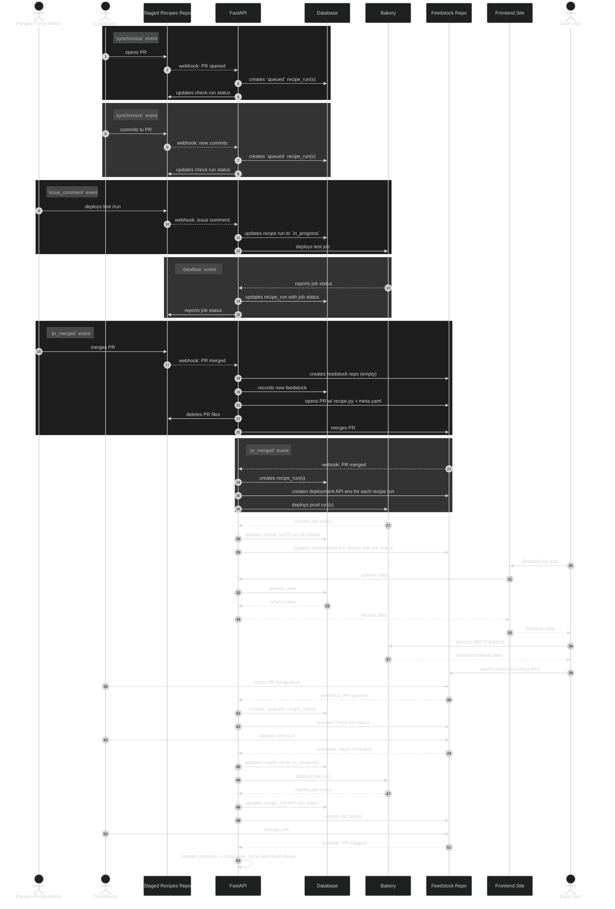

# Sequence of events: recipe PR to feedstock repo

```mermaid
sequenceDiagram
    %%{init: {'theme':'dark'}}%%
    autonumber
    actor Pangeo Forge Admin
    actor Contributor
    participant Staged Recipes Repo
    participant FastAPI
    participant Database
    participant Bakery
    participant Feedstock Repo
    participant Frontend Site
    actor Data User


    %% ------------------------
    %% (1) Contributor opens PR
    %% ------------------------

    rect rgb(30, 30, 30)
    note right of Contributor: `synchronize` event
    Contributor->>Staged Recipes Repo: opens PR
    Staged Recipes Repo-->>FastAPI: webhook: PR opened
    FastAPI->>Database: creates `queued` recipe_run(s)
    FastAPI->>Staged Recipes Repo: updates check run status
    end


    %% -----------------------------
    %% (2) Contributor commits to PR
    %% -----------------------------

    rect rgb(51, 51, 51)
    note right of Contributor: `synchronize` event
    Contributor->>Staged Recipes Repo: commits to PR
    Staged Recipes Repo-->>FastAPI: webhook: new commits
    FastAPI->>Database: creates `queued` recipe_run(s)
    FastAPI->>Staged Recipes Repo: updates check run status
    end


    %% ---------------------------
    %% (3) Admin deploys test /run
    %% ---------------------------

    rect rgb(30, 30, 30)
    note right of Pangeo Forge Admin: `issue_comment` event
    Pangeo Forge Admin->>Staged Recipes Repo: deploys test /run
    Staged Recipes Repo-->>FastAPI: webhook: issue comment
    FastAPI->>Database: updates recipe run to `in_progress`
    FastAPI->>Bakery: deploys test job
    end

    %% -------------------------
    %% (4) Job conclusion report
    %% -------------------------

    rect rgb(51, 51, 51)
    note right of Staged Recipes Repo: `dataflow` event
    Bakery-->>FastAPI: reports job status
    FastAPI->>Database: updates recipe_run with job status
    FastAPI->>Staged Recipes Repo: reports job status
    end

    %% -------------------------
    %% (5) Create feedstock repo
    %% -------------------------

    rect rgb(30, 30, 30)
    note right of Pangeo Forge Admin: `pr_merged` event
    Pangeo Forge Admin->>Staged Recipes Repo: merges PR
    Staged Recipes Repo-->>FastAPI: webhook: PR merged
    FastAPI->>Feedstock Repo: creates feedstock repo (empty)
    FastAPI->>Database: records new feedstock
    FastAPI->>Feedstock Repo: opens PR w/ recipe.py + meta.yaml
    FastAPI->>Staged Recipes Repo: deletes PR files
    FastAPI->>Feedstock Repo: merges PR
    end

    %% ----------------------------
    %% (6) Deploy production run(s)
    %% ----------------------------

    rect rgb(51, 51, 51)
    note right of FastAPI: `pr_merged` event
    Feedstock Repo-->>FastAPI: webook: PR merged
    FastAPI->>Database: creates recipe_run(s)
    FastAPI->>Feedstock Repo: creates deployment API env for each recipe run
    FastAPI->>Bakery: deploys prod run(s)
    end

    Bakery-->>FastAPI: reports job status
    FastAPI->>Database: updates recipe_run(s) w/ job status
    FastAPI->>Feedstock Repo: updates deployment API env(s) with job status
    Data User->>Frontend Site: Browses for data
    Frontend Site->>FastAPI: queries data
    FastAPI->>Database: queries data
    Database-->>FastAPI: returns data
    FastAPI-->>Frontend Site: returns data
    Frontend Site-->>Data User: displays data
    Data User->>Bakery: queries ARCO dataset
    Bakery-->>Data User: some erroneous data
    Data User->>Feedstock Repo: opens issue describing error
    Contributor->>Feedstock Repo: opens PR fixing issue
    Feedstock Repo-->>FastAPI: webhook: PR opened
    FastAPI->>Database: creates `queued` recipe_run(s)
    FastAPI->>Feedstock Repo: updates check run status
    Contributor->>Feedstock Repo: deploys test /run
    Feedstock Repo-->>FastAPI: webhook: issue comment
    FastAPI->>Database: updates recipe run to `in_progress`
    FastAPI->>Bakery: deploys test job
    Bakery-->>FastAPI: reports job status
    FastAPI->>Database: updates recipe_run with job status
    FastAPI->>Feedstock Repo: reports job status
    Contributor->>Feedstock Repo: merges PR
    Feedstock Repo-->>FastAPI: webook: PR merged
    FastAPI->>FastAPI: repeats prod run -> Data User cycle described above
```
