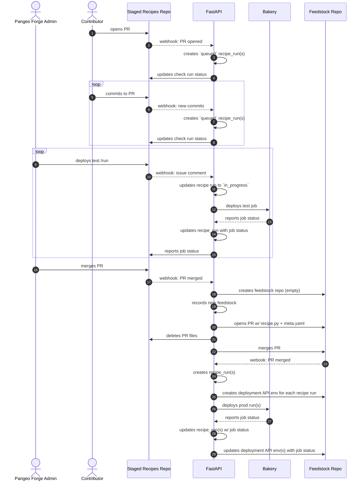
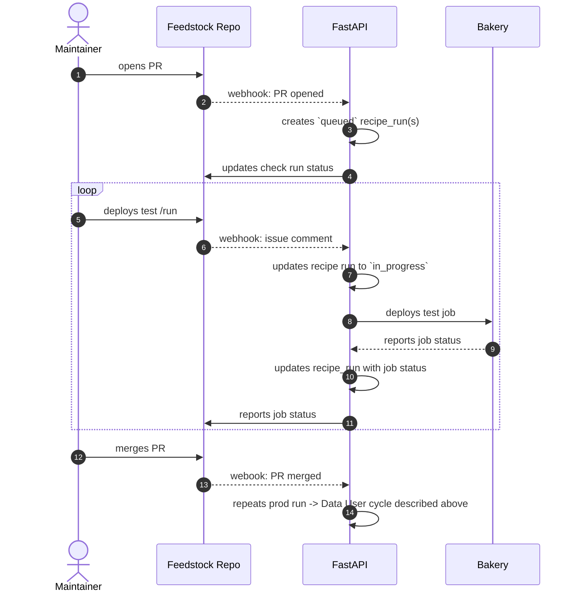

# Sequence of events: recipe PR to feedstock repo

# From `staged-recipes` PR to first production run

```mermaid
sequenceDiagram
    autonumber
    actor Pangeo Forge Admin
    actor Contributor
    participant Staged Recipes Repo
    participant FastAPI
    participant Bakery
    participant Feedstock Repo


    %% ------------------------
    %% (1) Contributor opens PR
    %% ------------------------

    Contributor->>Staged Recipes Repo: opens PR
    Staged Recipes Repo-->>FastAPI: webhook: PR opened
    FastAPI->>FastAPI: creates `queued` recipe_run(s)
    FastAPI->>Staged Recipes Repo: updates check run status


    %% -----------------------------
    %% (2) Contributor commits to PR
    %% -----------------------------

    loop
    Contributor->>Staged Recipes Repo: commits to PR
    Staged Recipes Repo-->>FastAPI: webhook: new commits
    FastAPI->>FastAPI: creates `queued` recipe_run(s)
    FastAPI->>Staged Recipes Repo: updates check run status
    end


    %% ---------------------------
    %% (3) Admin deploys test /run
    %% ---------------------------

    loop
    Pangeo Forge Admin->>Staged Recipes Repo: deploys test /run
    Staged Recipes Repo-->>FastAPI: webhook: issue comment
    FastAPI->>FastAPI: updates recipe run to `in_progress`
    FastAPI->>Bakery: deploys test job


    %% ---------------------------
    %% (4) Job status notification
    %% ---------------------------

    Bakery-->>FastAPI: reports job status
    FastAPI->>FastAPI: updates recipe_run with job status
    FastAPI->>Staged Recipes Repo: reports job status
    end

    %% -------------------------
    %% (5) Create feedstock repo
    %% -------------------------

    Pangeo Forge Admin->>Staged Recipes Repo: merges PR
    Staged Recipes Repo-->>FastAPI: webhook: PR merged
    FastAPI->>Feedstock Repo: creates feedstock repo (empty)
    FastAPI->>FastAPI: records new feedstock
    FastAPI->>Feedstock Repo: opens PR w/ recipe.py + meta.yaml
    FastAPI->>Staged Recipes Repo: deletes PR files
    FastAPI->>Feedstock Repo: merges PR

    %% ----------------------------
    %% (6) Deploy production run(s)
    %% ----------------------------

    Feedstock Repo-->>FastAPI: webook: PR merged
    FastAPI->>FastAPI: creates recipe_run(s)
    FastAPI->>Feedstock Repo: creates deployment API env for each recipe run
    FastAPI->>Bakery: deploys prod run(s)


    %% ---------------------------
    %% (7) Job status notification
    %% ---------------------------

    Bakery-->>FastAPI: reports job status
    FastAPI->>FastAPI: updates recipe_run(s) w/ job status
    FastAPI->>Feedstock Repo: updates deployment API env(s) with job status

```

```mermaid

sequenceDiagram
    autonumber
    actor Maintainer
    participant Feedstock Repo
    participant FastAPI
    participant Bakery

    %% -------------------
    %% (1) PR to fix error
    %% -------------------

    Maintainer->>Feedstock Repo: opens PR
    Feedstock Repo-->>FastAPI: webhook: PR opened
    FastAPI->>FastAPI: creates `queued` recipe_run(s)
    FastAPI->>Feedstock Repo: updates check run status


    %% --------------------
    %% (2) Deploy test run
    %% --------------------
    loop
    Maintainer->>Feedstock Repo: deploys test /run
    Feedstock Repo-->>FastAPI: webhook: issue comment
    FastAPI->>FastAPI: updates recipe run to `in_progress`
    FastAPI->>Bakery: deploys test job

    Bakery-->>FastAPI: reports job status
    FastAPI->>FastAPI: updates recipe_run with job status
    FastAPI->>Feedstock Repo: reports job status
    end

    Maintainer->>Feedstock Repo: merges PR
    Feedstock Repo-->>FastAPI: webook: PR merged
    FastAPI->>FastAPI: repeats prod run -> Data User cycle described above

```
