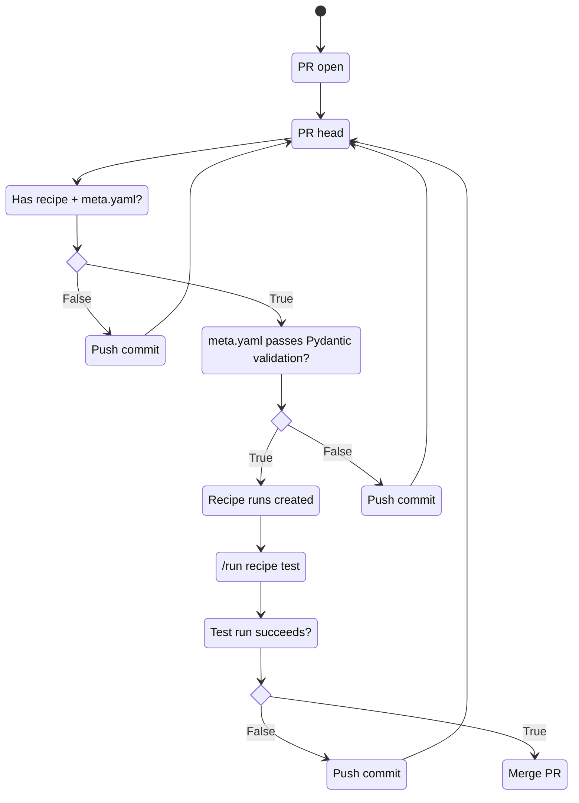

# State Diagram

```mermaid
stateDiagram-v2

    state "PR open" as PR_OPEN
    state "PR head" as PR_HEAD
    state "Has recipe + meta.yaml?" as HAS_FILES
    state "Push commit" as COMMIT_1
    state "Recipe runs created" as RECIPE_RUNS
    state "meta.yaml passes Pydantic validation?" as META_PARSE
    state "Push commit" as COMMIT_2
    state "/run recipe test" as SLASH_COMMAND
    state "Test run succeeds?" as TEST_SUCCESS
    state "Push commit" as COMMIT_3
    state "Merge PR" as MERGE

    state has_required_files <<choice>>
    state passes_pydantic_validation <<choice>>
    state slash_command_success <<choice>>

    [*] --> PR_OPEN
    PR_OPEN --> PR_HEAD
    PR_HEAD --> HAS_FILES

    HAS_FILES --> has_required_files
    has_required_files --> COMMIT_1: False
    has_required_files --> META_PARSE: True
    COMMIT_1 --> PR_HEAD

    META_PARSE --> passes_pydantic_validation
    passes_pydantic_validation --> COMMIT_2: False
    passes_pydantic_validation --> RECIPE_RUNS: True
    COMMIT_2 --> PR_HEAD

    RECIPE_RUNS --> SLASH_COMMAND
    SLASH_COMMAND --> TEST_SUCCESS
    TEST_SUCCESS --> slash_command_success
    slash_command_success --> COMMIT_3: False
    slash_command_success --> MERGE: True
    COMMIT_3 --> PR_HEAD
```
